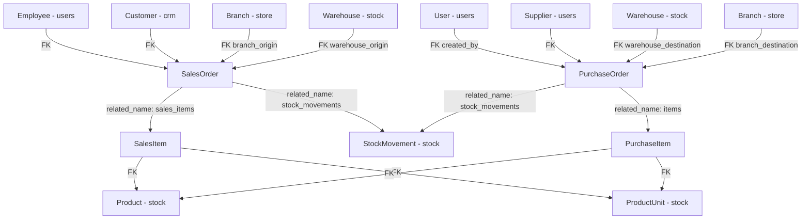

# Billing Module - Django Application

## Descripción General

El módulo `core.billing` gestiona el ciclo completo de compras y ventas del negocio. Implementa dos flujos de órdenes con máquinas de estado estrictas que disparan movimientos de stock automáticamente en cada transición. Es el núcleo operativo del sistema: integra stock, CRM, store y users para coordinar toda la actividad comercial.

Además expone un conjunto de endpoints de estadísticas para alimentar el dashboard interno, y genera PDFs descargables de cada orden.

---

## Modelos

### `SalesOrder` (Orden de Venta)

Representa una transacción de salida: venta a un cliente.

| Campo | Tipo | Descripción |
|-------|------|-------------|
| `employee` | FK → `Employee` | Quien registró la venta (auto-asignado) |
| `customer` | FK → `Customer` | Cliente comprador (nullable para venta mostrador) |
| `branch_origin` | FK → `Branch` | Sucursal de donde sale el stock |
| `warehouse_origin` | FK → `Warehouse` | Depósito de donde sale el stock |
| `status` | `CharField` (choices) | Estado actual de la orden |
| `sales_channel` | `CharField` (choices) | `ecommerce`, `storefront`, `wholesale` |
| `payment_method` | `CharField` | Método de pago (texto libre) |
| `delivery` | `BooleanField` | Si incluye envío a domicilio |
| `deliver_to` | `CharField` | Dirección de entrega (requerida si `delivery=True`) |
| `delivery_date` | `DateField` | Fecha de entrega acordada (nullable) |
| `total_price` | `DecimalField` | Total final calculado |
| `shipping_cost`, `taxes`, `discount` | `DecimalField` | Componentes del precio |
| `currency` | `CharField` | Moneda (default `ARS`) |
| `was_payed` | `BooleanField` | Marcado cuando el cliente pagó |
| `was_delivered` | `BooleanField` | Marcado cuando se entregó |
| `delivered_date` | `DateField` | Fecha real de entrega |
| `transport`, `driver`, `patent` | `CharField` | Datos logísticos del envío |
| `file_path` | `FileField` | Archivo adjunto (remito, factura, etc.) |
| `comments` | `JSONField` | Historial de comentarios internos |
| `description` | `TextField` | Observaciones de la orden |

### `SalesItem`

Línea de producto de una `SalesOrder`.

| Campo | Tipo | Descripción |
|-------|------|-------------|
| `sales_order` | FK → `SalesOrder` (related_name: `sales_items`) | |
| `product` | FK → `Product` | |
| `product_unit` | FK → `ProductUnit` (nullable) | Unidad de medida para conversión |
| `quantity` | `PositiveIntegerField` | En la unidad del `product_unit` |
| `unit_price` | `DecimalField` | Precio unitario al momento de la venta |

### `PurchaseOrder` (Orden de Compra)

Representa una transacción de entrada: compra a un proveedor.

| Campo | Tipo | Descripción |
|-------|------|-------------|
| `created_by` | FK → `User` | Usuario que creó la orden |
| `supplier` | FK → `Supplier` | Proveedor (nullable) |
| `warehouse_destination` | FK → `Warehouse` | Depósito destino del stock entrante |
| `branch_destination` | FK → `Branch` | Sucursal destino del stock entrante |
| `status` | `CharField` (choices) | Estado actual |
| `payment_method` | `CharField` | Método de pago |
| `delivery_date` | `DateField` | Fecha de entrega pactada con proveedor |
| `total_price` | `DecimalField` | Monto total de la compra |
| `taxes`, `discount`, `shipping_cost` | `DecimalField` | Componentes del precio |
| `currency` | `CharField` | Moneda (default `ARS`) |
| `was_payed` | `BooleanField` | Se pagó al proveedor |
| `received` | `BooleanField` | Se recibió la mercadería |
| `received_date` | `DateField` | Fecha real de recepción |
| `transport`, `driver`, `patent` | `CharField` | Datos del transporte del proveedor |
| `file_path` | `FileField` | Archivo adjunto (factura del proveedor, etc.) |
| `comments` | `JSONField` | Historial de cambios con auditoría automática |
| `description` | `TextField` | Observaciones internas |

### `PurchaseItem`

Línea de producto de una `PurchaseOrder`.

| Campo | Tipo | Descripción |
|-------|------|-------------|
| `purchase_order` | FK → `PurchaseOrder` (related_name: `items`) | |
| `product` | FK → `Product` | |
| `product_unit` | FK → `ProductUnit` (nullable) | Unidad de medida para conversión |
| `quantity` | `PositiveIntegerField` | En la unidad del `product_unit` |
| `unit_price` | `DecimalField` | Precio unitario de compra |

---

## Máquinas de Estado

### SalesOrder

```
              draft
             /     \
        pending   cancelled
           |
       processing ──────────→ cancelled
           |
       completed
```

| Transición | Efecto sobre Stock |
|------------|--------------------|
| `draft` → `pending` | Crea `StockMovement` OUT en estado `TRAN` (reserva) |
| `pending` → `processing` | Sin efecto en stock (ya estaba reservado) |
| `processing` → `completed` | Cambia movimientos `TRAN` → `REC`; descuenta stock físico con `F('quantity') - qty` |
| `* → cancelled` | Cambia movimientos `TRAN` → `CAN`; el stock reservado queda liberado automáticamente |

**Estados permitidos para `was_payed = True`**: solo en `processing`.  
**Estados permitidos para `was_delivered = True`**: solo en `processing`, y solo si ya está pagada.  
**Para llegar a `completed`**: debe tener `was_payed=True` y `was_delivered=True`.

### PurchaseOrder

```
    draft
   /     \
pending cancelled
   |
completed
```

| Transición | Efecto sobre Stock |
|------------|--------------------|
| `draft` → `pending` | Crea `StockMovement` IN en estado `TRAN` (mercadería en camino) |
| `pending` → `completed` | Cambia movimientos `TRAN` → `REC`; suma stock físico con `F('quantity') + qty` |
| `* → cancelled` | Cambia movimientos `TRAN` → `CAN`; el ingreso esperado se anula |

**Para llegar a `completed`**: debe tener `was_payed=True` y `received=True`.  
**Estados permitidos para `was_payed = True`**: solo en `pending`.  
**Estados permitidos para `received = True`**: solo en `pending`, y solo si ya está pagada.

> **Regla de oro**: `completed` y `cancelled` son estados terminales. Ninguno puede transicionar a otro estado.

---

## Sistema de Stock Movements

Los `StockMovement` del módulo `core.stock` son la pieza que vincula el estado de las órdenes con el inventario físico. Billing los crea y actualiza, stock los lee.

### Atributos clave de un StockMovement creado por Billing

**Para SalesOrder (reserva de salida)**:
```python
StockMovement(
    product=product,
    branch=origin_branch,      # XOR
    warehouse=origin_warehouse, # XOR
    status='TRAN',
    movement_type='OUT',
    from_location='BRA' / 'WHA',
    to_location='SAL',
    quantity=real_quantity,    # quantity * conversion_factor
    sale=sales_order,
    ...
)
```

**Para PurchaseOrder (entrada esperada)**:
```python
StockMovement(
    product=product,
    branch=destination_branch,     # XOR
    warehouse=destination_warehouse, # XOR
    status='TRAN',
    movement_type='IN',
    from_location='PUR',
    to_location='WHA' / 'BRA',
    quantity=real_quantity,
    purchase=purchase_order,
    ...
)
```

### Conversión de unidades

Todos los movimientos de stock se registran en la **unidad base** del producto, independientemente de la unidad con la que se creó el ítem:

```python
real_quantity = Decimal(str(quantity)) * conversion_factor
# Donde conversion_factor proviene de ProductUnit.conversion_factor
# Si no hay product_unit, conversion_factor = 1
```

---

## Validación de Stock en SalesOrder

La validación ocurre en `SalesOrderSerializer.validate()` y es la más compleja del sistema.

### Cuándo se ejecuta

| Situación | ¿Valida stock? |
|-----------|----------------|
| Creación (cualquier status inicial) | Sí |
| `draft` → `pending` | Sí |
| `pending`/`processing` con cambio de origen | Sí |
| Modificación de `sales_items` | Sí |
| Otros cambios de status | No |

### Fórmula de stock disponible

```python
available = (
    physical_stock           # Stock.quantity en la ubicación origen
    - total_reserved         # SUM de OUT TRAN en esa ubicación (excluyendo la orden actual)
    + total_incoming         # SUM de IN TRAN en esa ubicación (compras en camino)
)
```

### Resolución del origen

Si no se especifica `warehouse_origin_id` ni `branch_origin_id`:

1. Si el usuario no es `superadmin`: usa la sucursal del `Employee` asociado al `request.user`.
2. Si es `superadmin`: usa la primera sucursal con nombre que contenga `"Sucursal Principal"`.
3. Si se encuentra la sucursal automáticamente, se guarda en `data['branch_origin_id']`.
4. Si no se puede determinar: error 400 pidiendo origen explícito.

### Mensajes de error con alternativas

Cuando el stock es insuficiente en el origen, el error incluye:
- Stock físico, reservado y en tránsito desglosado.
- Lista de ubicaciones alternativas con stock disponible real.
- Si el origen fue especificado manualmente y hay alternativas: error estructurado con `stock_inconsistency: True` e `inconsistency_details` (para que el frontend pueda sugerir cambiar el origen).

---

## Autoasignación y Actualizaciones Automáticas

### `employee` en SalesOrder

En `perform_create`, se asigna automáticamente:
```python
if hasattr(self.request.user, 'employee'):
    employee = self.request.user.employee
sales_order = serializer.save(employee=employee)
```

### `created_by` en PurchaseOrder

Asignado en `perform_create` para usuarios con rol `employee`, `manager` o `superadmin`.

### `customer.total_spent` y `customer.last_purchase_date`

Billing actualiza estos campos de CRM automáticamente:

| Evento | Efecto en Customer |
|--------|-------------------|
| Creación de SalesOrder con `was_payed=True` | `total_spent += total_price` |
| `was_payed` cambia de `False` → `True` | `total_spent += total_price` |
| `was_payed` cambia de `True` → `False` | `total_spent -= old_total_price` |
| Orden pagada con precio cambiado | `total_spent = total_spent - old_price + new_price` |
| Delete de orden pagada | `total_spent -= total_price` |
| Creación de orden | `last_purchase_date = created_at` |

### `comments` en PurchaseOrder (auditoría automática)

Cada create/update agrega un entry al JSONField `comments`:
```json
{
    "comment": "Orden de compra creada por Ana García",
    "created_at": "2026-05-21T10:30:00+00:00",
    "fields_updated": ["status", "was_payed"],
    "updated_from": {
        "status": {"draft": "pending"},
        "was_payed": {"False": "True"}
    }
}
```
El campo `comment` puede ser reemplazado por un texto del usuario enviando `comment` en el body del request.

### Destino por defecto en PurchaseOrder

Si no se especifica `warehouse_destination_id` ni `branch_destination_id`, se asigna automáticamente la primera `Branch` cuyo nombre contenga `"Sucursal Principal"`.

---

## ViewSets y Endpoints

**Base URL**: `/api/`

### SalesOrderViewSet

```http
GET    /api/billing/sales-orders/               # Listar
POST   /api/billing/sales-orders/               # Crear
GET    /api/billing/sales-orders/{id}/          # Detalle
PUT    /api/billing/sales-orders/{id}/          # Actualizar
PATCH  /api/billing/sales-orders/{id}/          # Actualización parcial
DELETE /api/billing/sales-orders/{id}/          # Eliminar
GET    /api/billing/sales-orders/my-orders/     # Órdenes del cliente autenticado
GET    /api/billing/sales-orders/{id}/download-pdf/  # Descargar PDF
```

**Filtros de listado** (query params):

| Param | Tipo | Descripción |
|-------|------|-------------|
| `was_delivered` | `true`/`false` | Filtrar por estado de entrega |
| `sales_channel` | `ecommerce`/`storefront`/`wholesale` | Canal de venta |
| `customer_id` | int | Filtrar por cliente |

**`/my-orders/`**: Endpoint para clientes con rol `client`. Devuelve solo las órdenes del `Customer` vinculado al usuario autenticado. Error 404 si el usuario no tiene Customer asociado.

### PurchaseOrderViewSet

```http
GET    /api/billing/purchase-orders/            # Listar
POST   /api/billing/purchase-orders/            # Crear
GET    /api/billing/purchase-orders/{id}/       # Detalle
PUT    /api/billing/purchase-orders/{id}/       # Actualizar
PATCH  /api/billing/purchase-orders/{id}/       # Actualización parcial
DELETE /api/billing/purchase-orders/{id}/       # Eliminar
GET    /api/billing/purchase-orders/{id}/download-pdf/  # Descargar PDF
```

**Filtros de listado** (query params):

| Param | Tipo | Descripción |
|-------|------|-------------|
| `status` | string | Filtrar por estado |
| `supplier_id` | int | Filtrar por proveedor |
| `was_payed` | `true`/`false` | Filtrar por pago |
| `received` | `true`/`false` | Filtrar por recepción |

---

## Endpoints de Estadísticas

Todos requieren autenticación. Son `@api_view(['GET'])` independientes (no ViewSet).

### `GET /api/billing/stats/overview/`

Dashboard principal. Calcula métricas del mes actual vs. el anterior:

```json
{
    "total_sales": { "value": 850000.0, "formatted": "$850,000", "trend": "up", "trend_value": "12.5%" },
    "total_orders": { "value": 47, "trend": "up", "trend_value": "8.3%" },
    "total_purchases": { "value": 320000.0, "formatted": "$320,000", "trend": "down", "trend_value": "5.1%" },
    "total_customers": { "value": 142, "new_this_month": 8, "trend": "up", "trend_value": "+8 nuevos" },
    "inventory_value": { "value": 2100000.0, "formatted": "$2,100,000" },
    "low_stock_products": { "value": 3, "trend": "down", "trend_value": "Requieren atención" }
}
```

**Nota**: `total_sales` y `total_purchases` incluyen solo órdenes con status `pending`, `processing` o `completed` (excluye `draft` y `cancelled`). El valor de inventario se calcula como `SUM(stock.quantity * product.cost_price)`.

### `GET /api/billing/stats/sales-chart/?period=week`

Datos para gráfico de ventas. Siempre devuelve todos los slots del período (con 0 si no hay datos).

| `period` | Granularidad | Slots |
|----------|-------------|-------|
| `week` (default) | Por día | 7 días (Lun-Dom) |
| `month` | Por semana | 4 semanas |
| `year` | Por mes | 12 meses |

```json
[
    { "day": "Lun", "sales": 45000.0, "orders": 3 },
    { "day": "Mar", "sales": 0, "orders": 0 },
    ...
]
```

### `GET /api/billing/stats/top-products/?limit=6`

Productos más vendidos del mes actual, ordenados por ingresos (`quantity * unit_price`). Default `limit=6`.

```json
[
    { "id": 5, "sku": "PROD-001", "description": "Producto A", "category": "Electrónica",
      "units_sold": 120, "revenue": 240000.0, "trend": "up" }
]
```

### `GET /api/billing/stats/stock-alerts/?limit=10`

Productos con `stock.quantity < product.safety_stock`. Excluye productos con `safety_stock=0`.

Niveles de criticidad:
- `critical`: stock < 25% del safety_stock
- `warning`: stock entre 25% y 50%
- `low`: stock entre 50% y 100%

### `GET /api/billing/stats/sales-by-channel/`

Distribución de ventas del mes actual por canal, con porcentajes.

### `GET /api/billing/stats/order-status/`

Conteo de todas las `SalesOrder` del sistema por estado (sin filtro de fecha).

---

## Generador de PDF (`OrderPDFGenerator`)

Clase en `pdf_generator.py` que usa **ReportLab** para generar PDFs A4 de órdenes.

### Uso

```python
generator = OrderPDFGenerator(order, order_type='sales')  # o 'purchase'
generator.generate('/ruta/archivo.pdf')
```

El view crea un archivo temporal, genera el PDF, lo sirve como `HttpResponse` con `Content-Type: application/pdf` y luego elimina el temporal con `os.unlink()`.

### Estructura del PDF

1. **Header**: Título (`ORDEN DE VENTA` / `ORDEN DE COMPRA`), número, fecha, estado, datos de la tienda y logo.
2. **Info de contraparte**: Datos del cliente (venta) o proveedor (compra).
3. **Tabla de ítems**: SKU, descripción, unidad, cantidad, precio unitario, total por línea.
4. **Tabla de totales**: Subtotal, descuento, IVA, envío, **TOTAL**.
5. **Footer**: Observaciones, método de pago, fecha de entrega, transporte.

### Resolución de la tienda para el PDF

1. Intenta obtener la `Store` desde `order.employee.store` (ventas) o `order.created_by.employee.store` (compras).
2. Si falla, usa `Store.objects.filter(is_active=True).first()` como fallback.

---

## Serializers

### `SalesOrderSerializer`

- **`sales_items`**: Anidado, write-through. En creación/actualización con items, **reemplaza** la lista completa (delete + recreate).
- **`customer`** / **`customer_id`**: Patrón read/write split — `customer` es read-only (objeto completo), `customer_id` es write-only (ID para asignar).
- **`warehouse_origin`** / **`warehouse_origin_id`**: Mismo patrón.
- **`branch_origin`** / **`branch_origin_id`**: Mismo patrón.
- **Creación forzada**: `status='draft'`, `was_payed=False`, `was_delivered=False` (ignorado si se envía otro valor).
- **`employee`**: read-only; asignado en `perform_create`.

### `PurchaseOrderSerializer`

- **`items`**: Anidado, write-through. Reemplaza la lista completa en updates.
- **`comment`**: Campo write-only temporal. No se guarda en `comments` directamente; el view lo incorpora al entry de auditoría automática.
- **`comments`**: read-only desde la API (solo se puede leer el historial, no escribirlo directamente).
- **Creación forzada**: `status='draft'`, `was_payed=False`, `received=False`.

### `PurchaseItemSerializer`

Normaliza `conversion_factor` con `.normalize()` para eliminar ceros trailing (ej: `2.0000` → `2`).

---

## Relaciones entre Modelos



---

## Estructura de Archivos

```
core/billing/
├── models.py         # PurchaseOrder, PurchaseItem, SalesOrder, SalesItem
├── serializer.py     # Serializers con máquinas de estado y validación de stock
├── views.py          # SalesOrderViewSet, PurchaseOrderViewSet + 6 funciones de stats
├── pdf_generator.py  # OrderPDFGenerator (ReportLab)
├── urls.py           # Router + stats_urls
├── admin.py
├── apps.py
└── migrations/
```

---

## Flujos de Uso Típicos

### 1. Crear y confirmar una venta interna (storefront)

```http
# Paso 1: Crear como draft
POST /api/billing/sales-orders/
{
    "customer_id": 15,
    "sales_channel": "storefront",
    "payment_method": "efectivo",
    "delivery": false,
    "total_price": 25000,
    "sales_items": [
        { "product": 3, "quantity": 2, "unit_price": 12500 }
    ]
}
# → status='draft', sin afectar stock

# Paso 2: Confirmar (reservar stock desde la sucursal del empleado)
PATCH /api/billing/sales-orders/42/
{
    "status": "pending"
}
# El serializer auto-detecta branch_origin del empleado
# → StockMovement OUT TRAN creado

# Paso 3: Marcar como pagada y en preparación
PATCH /api/billing/sales-orders/42/
{
    "status": "processing",
    "was_payed": true
}

# Paso 4: Marcar como entregada y completar
PATCH /api/billing/sales-orders/42/
{
    "was_delivered": true,
    "status": "completed"
}
# → StockMovement TRAN → REC, stock físico descontado
```

### 2. Crear y recibir una orden de compra

```http
# Paso 1: Crear presupuesto de compra
POST /api/billing/purchase-orders/
{
    "supplier_id": 5,
    "payment_method": "transferencia",
    "delivery_date": "2026-06-01",
    "total_price": 150000,
    "branch_destination_id": 2,
    "items": [
        { "product": 8, "quantity": 100, "unit_price": 1500 }
    ]
}
# → status='draft', sin afectar stock

# Paso 2: Confirmar orden (mercadería en camino)
PATCH /api/billing/purchase-orders/17/
{
    "status": "pending",
    "comment": "Confirmado con el proveedor"
}
# → StockMovement IN TRAN creado
# El stock disponible del producto YA considera esta mercadería en camino

# Paso 3: Registrar pago
PATCH /api/billing/purchase-orders/17/
{
    "was_payed": true,
    "comment": "Pago por transferencia bancaria"
}

# Paso 4: Registrar recepción y completar
PATCH /api/billing/purchase-orders/17/
{
    "received": true,
    "received_date": "2026-06-02",
    "status": "completed",
    "comment": "Mercadería recibida completa"
}
# → StockMovement TRAN → REC, stock físico sumado en branch_destination
```

### 3. Venta originada desde ecommerce

```http
# El checkout de ecommerce ya crea la SalesOrder con status='draft' y sales_channel='ecommerce'
# El equipo interno la revisa y confirma:
PATCH /api/billing/sales-orders/88/
{
    "status": "pending",
    "warehouse_origin_id": 3
}
```

### 4. Ver las órdenes como cliente

```http
GET /api/billing/sales-orders/my-orders/
# Requiere autenticación con rol 'client'
# Devuelve solo las órdenes del Customer vinculado al usuario
```

---

## Consideraciones de Diseño

### Origen único de stock

Tanto `SalesOrder` como `PurchaseOrder` tienen un **único origen/destino**: `warehouse` XOR `branch`. El serializer rechaza si se especifican ambos. Esto mantiene la lógica de movimientos de stock simple y trazable.

### Concurrencia y race conditions

Las actualizaciones de stock físico usan `F('quantity')` expressions de Django ORM para ser seguras ante escrituras concurrentes:

```python
Stock.objects.filter(...).update(quantity=F('quantity') - movement.quantity)
```

La creación de movimientos usa `bulk_create` para minimizar el número de queries.

Las actualizaciones de PurchaseOrder están envueltas en `transaction.atomic()`.

### `draft` no bloquea stock

Tanto en ventas como en compras, el estado `draft` es un presupuesto que no genera ningún movimiento de inventario. El stock solo se bloquea/modifica al transicionar a `pending`. Esto permite crear cotizaciones sin impactar operaciones reales.

### Eliminación de órdenes

Eliminar una `SalesOrder` pagada descuenta el `total_spent` del cliente antes de borrar. Los movimientos de stock asociados se eliminan en cascada (FK con `CASCADE`). **No se recalcula el stock físico**: se asume que si se borra una orden ya procesada, el ajuste de stock debe hacerse manualmente o a través del módulo de auditoría.

---

*Este documento sirve como referencia completa para desarrolladores y agentes de IA que trabajen con el módulo de billing.*
