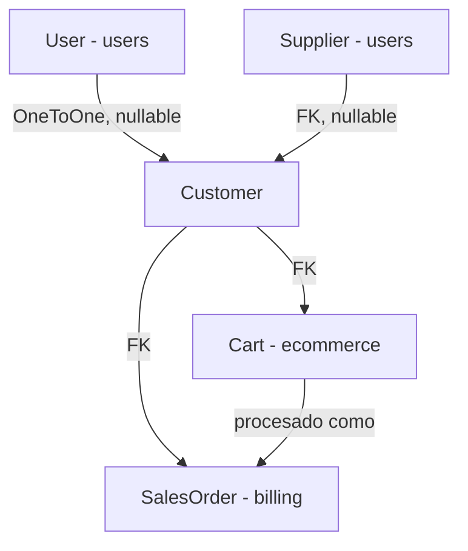

# CRM Module - Django Application

## Descripción General

El módulo `core.crm` gestiona el ciclo de vida de los clientes del negocio. Soporta dos tipos de clientes (persona física y empresa), mantiene un historial de contactos como registro de interacciones comerciales, y actúa como el punto de vinculación entre el sistema interno (operado por staff) y el ecommerce público (operado por el cliente final). Es uno de los módulos más referenciados: billing lo usa para asociar órdenes, ecommerce para carritos y checkout, y stock para clientes en operaciones de inventario.

## Arquitectura del Módulo

### Modelo Principal: `Customer`

Un único modelo que unifica dos entidades del mundo real con campos diferenciados por tipo.

#### Campos comunes a todos los clientes

| Campo | Tipo | Descripción |
|-------|------|-------------|
| `customer_type` | `CharField` (choices) | `'person'` o `'company'` |
| `user` | `OneToOneField → User` | Vinculación con cuenta de ecommerce (null si no tiene cuenta) |
| `supplier` | `ForeignKey → Supplier` | Si el cliente también es proveedor |
| `email` | `EmailField` | Único en la tabla |
| `phone`, `address`, `city`, `state`, `country`, `postal_code` | `CharField` | Datos de contacto/ubicación |
| `comments` | `TextField` | Comentario libre del equipo interno |
| `contact_history` | `JSONField` | Historial de interacciones (ver más abajo) |
| `last_purchase_date` | `DateTimeField` | Actualizado por billing |
| `total_spent` | `DecimalField` | Monto total acumulado de compras |
| `created_at`, `updated_at` | `DateTimeField` | Auto-gestionados |

#### Campos exclusivos de persona física (`customer_type = 'person'`)

| Campo | Tipo |
|-------|------|
| `first_name` | `CharField` |
| `last_name` | `CharField` |
| `date_of_birth` | `DateField` |

#### Campos exclusivos de empresa (`customer_type = 'company'`)

| Campo | Tipo |
|-------|------|
| `name` | `CharField` (unique) |
| `fantasy_name` | `CharField` |
| `cuit` | `CharField` |

> **Invariante importante**: los serializers de creación y actualización **nullifican automáticamente** los campos del tipo contrario. Si un customer es `person`, los campos `name`, `fantasy_name` y `cuit` se guardan como `null`, y viceversa. Esto garantiza consistencia sin necesidad de heredar modelos.

#### Vinculación con Ecommerce

El campo `user` es `null` por defecto. Un cliente creado desde el CRM interno no tiene usuario hasta que se registra en el ecommerce. Cuando esto ocurre, `ecommerce.CustomerRegistrationSerializer` detecta el email coincidente y vincula el `User` recién creado al `Customer` existente, preservando el historial de compras y contactos.

### Historial de Contactos (`contact_history`)

Es un `JSONField` que almacena un array ordenado cronológicamente. Cada entrada tiene esta estructura:

```json
{
    "date": "2026-05-21T10:30:00+00:00",
    "comment": "Llamada telefónica, interesado en producto X",
    "medium": "telefono",
    "user": "Ana García",
    "user_id": 5
}
```

Cuando un contacto es editado, se agregan dos campos extra al entry:
```json
{
    "edited_date": "2026-05-22T09:00:00+00:00",
    "edited_by": "manager_username"
}
```

El campo `medium` es libre (teléfono, email, presencial, WhatsApp, etc.) y no tiene choices forzados.

### Métodos del Modelo

```python
customer.add_contact(comment, medium=None, user=None)
# Agrega un entry al JSONField contact_history y guarda el modelo.
# Si user es None, el autor queda como 'Sistema'.
# Retorna el dict del contacto recién creado.

customer.get_last_contact_date()
# Retorna el ISO string del último contacto, o None si no hay historial.

customer.get_contacts_count()
# Retorna el número total de entradas en contact_history.
```

---

## ViewSet y Endpoints

El módulo usa un único `CustomerViewSet` (ModelViewSet) registrado en el router.

**Base URL**: `/api/crm/customers/`

### Endpoints Estándar

```http
GET    /api/crm/customers/           # Listar clientes
POST   /api/crm/customers/           # Crear cliente
GET    /api/crm/customers/{id}/      # Detalle de cliente
PUT    /api/crm/customers/{id}/      # Actualización completa
PATCH  /api/crm/customers/{id}/      # Actualización parcial
DELETE /api/crm/customers/{id}/      # Eliminar cliente
```

### Endpoints Personalizados (Actions)

```http
POST   /api/crm/customers/{id}/contact/            # Agregar contacto al historial
GET    /api/crm/customers/{id}/contact_history/    # Ver historial completo
PATCH  /api/crm/customers/{id}/update_contact/     # Editar un contacto por índice
DELETE /api/crm/customers/{id}/delete_contact/     # Eliminar un contacto por índice
PATCH  /api/crm/customers/{id}/update_purchase_info/  # Actualizar datos de compras
GET    /api/crm/customers/stats/                   # Estadísticas globales de clientes
GET    /api/crm/customers/search/                  # Búsqueda avanzada (máx. 20 resultados)
```

---

## Descripción Detallada de Endpoints

### `GET /customers/` — Listar clientes

Usa `CustomerListSerializer` (campos resumidos, sin `contact_history` completo).

**Filtros por query params**:

| Param | Tipo | Descripción |
|-------|------|-------------|
| `type` | `person` / `company` | Filtrar por tipo de cliente |
| `has_purchases` | `true` / `false` | Tiene o no compras registradas |
| `min_spent` | float | Gasto mínimo acumulado |
| `max_spent` | float | Gasto máximo acumulado |
| `search` | string | Búsqueda en: `first_name`, `last_name`, `name`, `fantasy_name`, `email`, `cuit`, `phone` |
| `ordering` | string | Ordenar por: `created_at`, `updated_at`, `last_purchase_date`, `total_spent` (prefix `-` para descender) |

**Orden por defecto**: `-created_at` (más recientes primero).

Soporta paginación estándar de DRF. Sin paginación retorna `{ "count": N, "results": [...] }`.

### `POST /customers/` — Crear cliente

**Permisos requeridos**: rol `superadmin`, `manager` o `employee`. Los `client` no pueden crear clientes CRM.

La respuesta usa `CustomerDetailSerializer` (más completo que el serializer de creación).

**Body para persona física**:
```json
{
    "customer_type": "person",
    "first_name": "Juan",
    "last_name": "Pérez",
    "email": "juan@mail.com",
    "phone": "+54 11 1234-5678",
    "city": "Buenos Aires",
    "country": "Argentina"
}
```

**Body para empresa**:
```json
{
    "customer_type": "company",
    "name": "Distribuidora XYZ S.A.",
    "fantasy_name": "XYZ",
    "cuit": "30-12345678-9",
    "email": "contacto@xyz.com",
    "phone": "+54 11 9999-0000"
}
```

### `DELETE /customers/{id}/` — Eliminar cliente

**Permisos requeridos**: rol `superadmin` o `manager`.

**Restricción de negocio**: No se puede eliminar un cliente con `total_spent > 0`. Esto protege la integridad del historial contable.

**Efecto cascada**: Si el cliente tiene un `User` vinculado (cuenta de ecommerce), **ese User también se elimina**.

### `POST /customers/{id}/contact/` — Agregar contacto

Registra una interacción con el cliente. Internamente llama a `customer.add_contact()`.

```json
{
    "comment": "Llamó consultando disponibilidad del producto X",
    "medium": "telefono"
}
```

El `user` del contacto se obtiene automáticamente del usuario autenticado (`request.user`). La respuesta incluye el contacto recién agregado y el total acumulado.

### `GET /customers/{id}/contact_history/` — Historial de contactos

Devuelve el array completo de `contact_history` con metadatos:

```json
{
    "customer_id": 7,
    "customer_name": "Juan Pérez",
    "contact_history": [...],
    "total_contacts": 5,
    "last_contact_date": "2026-05-21T10:30:00+00:00"
}
```

### `PATCH /customers/{id}/update_contact/` — Editar un contacto

Permite corregir el `comment` de una entrada existente usando su índice en el array.

```json
{
    "contact_index": 2,
    "comment": "Texto corregido del contacto"
}
```

Agrega `edited_date` y `edited_by` (username) al entry modificado. No elimina los datos originales.

### `DELETE /customers/{id}/delete_contact/` — Eliminar un contacto

Elimina una entrada del historial por índice. El índice es posicional en el array (0-based).

```json
{
    "contact_index": 1
}
```

La respuesta incluye el contacto eliminado y el conteo restante.

### `PATCH /customers/{id}/update_purchase_info/` — Actualizar datos de compras

Endpoint dedicado para que el módulo de billing o procesos internos actualicen `last_purchase_date` y `total_spent`. Solo acepta esos dos campos.

```json
{
    "last_purchase_date": "2026-05-21T15:00:00Z",
    "total_spent": 125000.00
}
```

### `GET /customers/stats/` — Estadísticas globales

Devuelve un resumen agregado de toda la base de clientes:

```json
{
    "total_customers": 342,
    "total_persons": 289,
    "total_companies": 53,
    "customers_with_purchases": 198,
    "customers_without_purchases": 144,
    "customers_with_contacts": 215,
    "customers_without_contacts": 127,
    "total_revenue": 8750000.00,
    "average_spent_per_customer": 25584.79,
    "recent_customers": 12,
    "total_contacts": 643,
    "average_contacts_per_customer": 2.99,
    "top_countries": [{"country": "Argentina", "count": 320}, ...],
    "top_cities": [{"city": "Buenos Aires", "state": "CABA", "count": 145}, ...]
}
```

`recent_customers` = clientes creados en los últimos 30 días.

### `GET /customers/search/` — Búsqueda avanzada

Búsqueda rápida multi-campo, limitada a 20 resultados. Pensada para autocomplete o búsquedas puntuales desde el frontend.

**Query params**:
- `q` (requerido): texto a buscar en `first_name`, `last_name`, `name`, `fantasy_name`, `email`, `cuit`, `phone`.
- `type`: filtro adicional por tipo.
- `country`: filtro adicional por país.

```http
GET /api/crm/customers/search/?q=juan&type=person
```

---

## Serializers

### `CustomerListSerializer`

Para el listado. Incluye campos calculados pero **no** incluye `contact_history` (array potencialmente grande).

Campos calculados:
- `full_name`: Para personas → `"first_name last_name"`. Para empresas → `name` o `fantasy_name`.
- `display_name`: Igual que `full_name` pero con fallback `'Sin nombre'`.
- `last_contact_date`: Delegado a `customer.get_last_contact_date()`.
- `contacts_count`: Delegado a `customer.get_contacts_count()`.

### `CustomerDetailSerializer`

Para `retrieve` y como respuesta post-creación/actualización. Incluye `contact_history` completo, `user_username` y `supplier_name` como campos read-only decorativos.

### `CustomerCreateSerializer`

Valida y limpia campos según `customer_type`:

| Condición | Requerido | Nullificados automáticamente |
|-----------|-----------|------------------------------|
| `person` | `first_name`, `last_name` | `name`, `fantasy_name`, `cuit` |
| `company` | `name` | `first_name`, `last_name`, `date_of_birth` |

Valida unicidad de `email` y `cuit` en el momento de creación.

### `CustomerUpdateSerializer`

Misma lógica de validación que `CustomerCreateSerializer` pero adaptada para actualizaciones parciales: solo valida los campos que cambian, y la unicidad de email/cuit excluye la instancia actual.

Permite además actualizar `contact_history`, `last_purchase_date` y `total_spent` directamente (a diferencia del serializer de creación).

### `CustomerContactSerializer`

Serializer de acción específica. Acepta `comment` y `medium` (write-only), y llama a `instance.add_contact()` en el `update()`. Devuelve el campo `contact_history` actualizado.

### `CustomerContactUpdateSerializer`

Serializer de tipo `Serializer` (no `ModelSerializer`). Opera directamente sobre el array del JSONField usando el `contact_index` como puntero. Valida que el índice sea válido contra la longitud del historial actual.

---

## Sistema de Permisos

Todos los endpoints requieren autenticación (`IsAuthenticated`). Los permisos adicionales se verifican manualmente en cada acción:

| Operación | Roles permitidos |
|-----------|-----------------|
| Listar, ver detalle | Todos los autenticados (`superadmin`, `manager`, `employee`, `client`) |
| Crear cliente | `superadmin`, `manager`, `employee` |
| Actualizar cliente | `superadmin`, `manager`, `employee` (o el propio `client` sobre su registro) |
| Eliminar cliente | `superadmin`, `manager` |
| Gestión de contactos | Todos los autenticados |
| Stats, search | Todos los autenticados |

> Los clientes con rol `client` pueden actualizar su propio registro a través de `ecommerce.CustomerData`. El endpoint CRM también permite actualizarlo si `request.user == instance.user`, aunque en la práctica el ecommerce es la interfaz preferida para clientes.

---

## Relaciones entre Modelos



---

## Estructura de Archivos

```
core/crm/
├── models.py        # Customer con sus métodos de negocio
├── serializer.py    # 7 serializers especializados por operación
├── views.py         # CustomerViewSet con 7 actions personalizadas
├── urls.py          # Router con customers registrado
├── admin.py
├── apps.py
└── migrations/
```

---

## Casos de Uso Típicos

### 1. Crear un cliente desde el sistema interno

```http
POST /api/crm/customers/
{
    "customer_type": "person",
    "first_name": "María",
    "last_name": "López",
    "email": "maria@mail.com",
    "phone": "+54 9 351 123-4567",
    "city": "Córdoba",
    "country": "Argentina"
}
```

### 2. Registrar una interacción comercial

```http
POST /api/crm/customers/42/contact/
{
    "comment": "Reunión presencial. Cotizamos 50 unidades del producto A.",
    "medium": "presencial"
}
```

### 3. Ver el historial completo de un cliente

```http
GET /api/crm/customers/42/contact_history/
```

### 4. Corregir un contacto mal cargado

```http
PATCH /api/crm/customers/42/update_contact/
{
    "contact_index": 3,
    "comment": "Llamada telefónica (no presencial). Se cotizaron 30 unidades."
}
```

### 5. Buscar un cliente rápidamente

```http
GET /api/crm/customers/search/?q=distribuidora&type=company
```

### 6. Filtrar clientes de alto valor

```http
GET /api/crm/customers/?min_spent=50000&ordering=-total_spent
```

---

## Integración con Otros Módulos

### Módulos que consumen CRM

- **`core.ecommerce`**: Usa `Customer` como dueño del carrito y destino del checkout. El registro de ecommerce vincula `User` al `Customer` existente.
- **`core.billing`**: Asocia `SalesOrder` a un `Customer`. Actualiza `total_spent` y `last_purchase_date` tras cada venta confirmada.

### Módulos que CRM consume

- **`users.User`**: Vinculación opcional para clientes con cuenta de ecommerce.
- **`users.Supplier`**: Un mismo proveedor puede ser también cliente (`supplier` FK nullable).

---

## Consideraciones de Diseño

### JSONField para contact_history

El historial de contactos se almacena en un `JSONField` en lugar de una tabla separada. Esto simplifica las consultas y el modelo de datos, a cambio de:
- No poder filtrar/ordenar por atributos del historial desde ORM (requeriría `__contains` o queries raw).
- Ausencia de integridad referencial dentro del historial (el `user_id` puede apuntar a un usuario eliminado).

Para el volumen esperado de contactos por cliente (decenas, no miles), este trade-off es razonable.

### Eliminación en cascada de User

Al eliminar un Customer con `user` asociado, el módulo **elimina también el User** (`Users.objects.filter(id=instance.user.id).delete()`). Esto es intencional para mantener consistencia: si un cliente deja de existir en el CRM, su cuenta de ecommerce también desaparece. Tenerlo en cuenta antes de llamar a `DELETE /customers/{id}/`.

### `total_spent` es un campo calculado-pero-persistido

No se recalcula en tiempo real desde las órdenes. Es actualizado explícitamente por billing al confirmar una venta. Si hay inconsistencias, usar `update_purchase_info` para corregir manualmente hasta que exista un proceso de reconciliación automático.

---

*Este documento sirve como referencia completa para desarrolladores y agentes de IA que trabajen con el módulo de CRM.*
