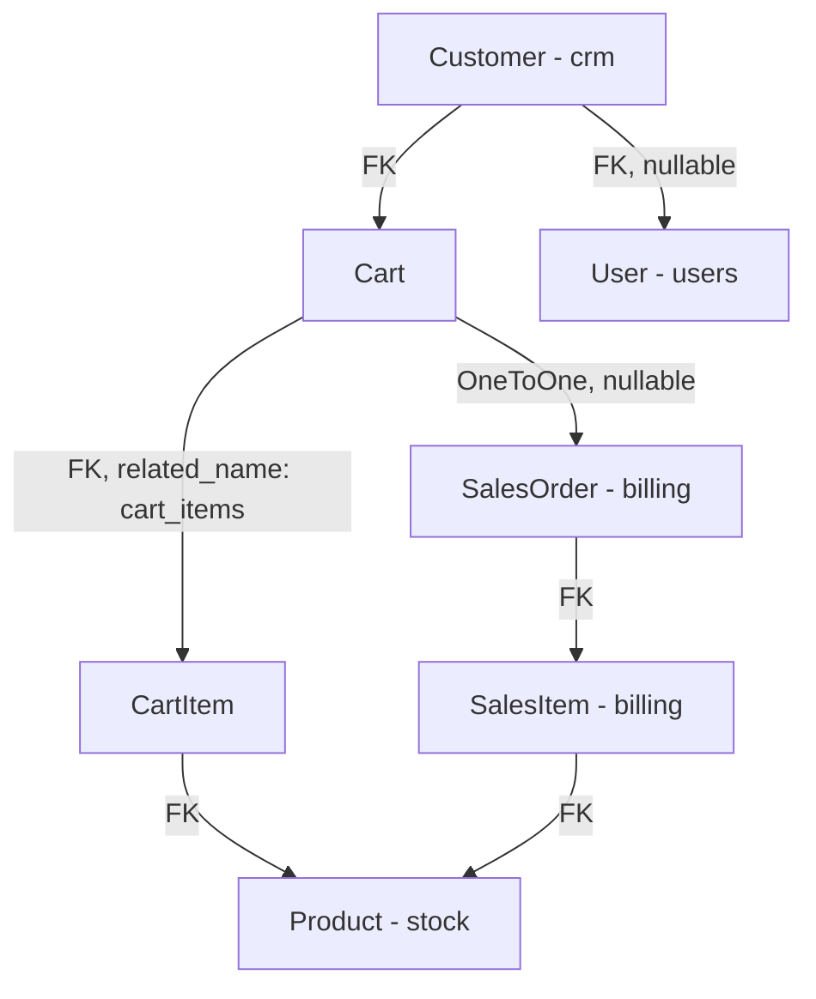

# Ecommerce Module - Django Application

## Descripción General

El módulo `core.ecommerce` es la capa pública del sistema orientada al cliente final. Expone un conjunto de endpoints sin autenticación para que un frontend de tienda online pueda listar productos y catálogos, y endpoints autenticados para que los clientes registrados gestionen su carrito y realicen el checkout. El resultado del checkout es una `SalesOrder` en estado `draft` que el equipo interno puede luego confirmar desde el módulo de billing.

## Arquitectura del Módulo

### Modelos Propios

#### 1. **Cart (Carrito)**
- **Propósito**: Representa el carrito de compras activo de un cliente.
- **Relaciones**:
  - `customer` → FK a `crm.Customer` (obligatorio)
  - `sales_order` → OneToOne a `billing.SalesOrder` (null hasta el checkout)
- **Estado activo**: Un carrito está "activo" mientras `sales_order` sea `null`. Una vez procesado el checkout, `sales_order` se asigna y el carrito queda congelado.
- **Campos**: `created_at`, `updated_at` (auto)

#### 2. **CartItem (Ítem del carrito)**
- **Propósito**: Cada línea de producto dentro de un carrito.
- **Relaciones**:
  - `cart` → FK a `Cart` (related_name: `cart_items`)
  - `product` → FK a `stock.Product`
- **Campos**: `quantity` (PositiveIntegerField), `added_at`, `updated_at`

### Dependencias con Otros Módulos

Este módulo es principalmente de **lectura y orquestación**: no define sus propios productos, clientes ni órdenes, sino que los referencia y crea instancias en otros módulos.

| Módulo | Modelos utilizados | Propósito |
|--------|--------------------|-----------|
| `core.stock` | `Product`, `Category`, `Subcategory`, `Stock` | Catálogo y disponibilidad |
| `core.billing` | `SalesOrder`, `SalesItem`, `PurchaseOrder`, `PurchaseItem` | Checkout y cálculo de stock disponible |
| `core.crm` | `Customer` | Dueño del carrito, datos del comprador |
| `users` | `User`, `Supplier` | Registro de cliente, listado de proveedores |

## Endpoints y Vistas

### Resumen de URLs

**Base URL**: `/api/ecommerce/`

| Método | Endpoint | Auth | Descripción |
|--------|----------|------|-------------|
| `GET` | `products/` | No | Listar productos con filtros y paginación |
| `GET` | `products/<id>/` | No | Detalle de producto |
| `GET` | `categories/` | No | Listar categorías |
| `GET` | `subcategories/` | No | Listar subcategorías (filtrable por categoría) |
| `GET` | `suppliers/` | No | Listar proveedores |
| `POST` | `register/` | No | Registro de nuevo cliente |
| `GET/POST` | `carts/` | Sí | Obtener o crear carrito activo |
| `GET/POST/PUT/DELETE` | `carts/<id>/items/` | Sí | Gestionar ítems del carrito |
| `PUT/DELETE` | `carts/<id>/items/<item_id>/` | Sí | Actualizar o eliminar ítem específico |
| `GET/PATCH/PUT` | `customers/me/` | Sí | Perfil del cliente autenticado |
| `POST` | `carts/<id>/checkout/` | Sí | Convertir carrito en orden de venta |

---

### Vistas Públicas (AllowAny)

#### `ProductList` — `GET /products/`

Lista productos con paginación y múltiples filtros opcionales vía query params.

**Paginación**: 4 productos por página (configurable con `page_size`, máx. 100).

**Query params disponibles**:

| Param | Tipo | Descripción |
|-------|------|-------------|
| `category` | int | Filtrar por ID de categoría |
| `subcategory` | int | Filtrar por ID de subcategoría |
| `supplier` | int | Filtrar por ID de proveedor |
| `search` | string | Búsqueda por descripción o SKU (case-insensitive) |
| `min_price` | float | Precio mínimo |
| `max_price` | float | Precio máximo |
| `sort_by` | string | Orden: `price_asc`, `price_desc`, `name_asc`, `name_desc`, `newest` |

**Orden por defecto**: Mayor stock disponible primero (`-total_stock`).

#### `ProductDetail` — `GET /products/<id>/`

Devuelve el detalle de un producto. Retorna `404` si no existe.

#### `CategoryList` — `GET /categories/`

Devuelve todas las categorías ordenadas por nombre.

#### `SubcategoryList` — `GET /subcategories/`

Devuelve subcategorías. Acepta `?category=<id>` para filtrar por categoría padre.

#### `SupplierList` — `GET /suppliers/`

Devuelve todos los proveedores del sistema.

#### `CustomerRegistration` — `POST /register/`

Registra un nuevo cliente del ecommerce. Ver sección [Registro de Clientes](#registro-de-clientes).

---

### Vistas Autenticadas (IsAuthenticated)

#### `CartManagement` — `GET /carts/` y `POST /carts/`

**GET**: Requiere `?customer_id=<id>`. Devuelve el carrito activo (sin `sales_order`) del cliente. Si no existe, lo crea (via `get_or_create`).

**POST**: Crea un carrito para el cliente indicado en `customer_id`. Verifica que el `user` autenticado sea el dueño del customer (previene acceso cruzado). Si ya existe un carrito activo, devuelve ese en lugar de crear uno nuevo.

#### `CartItemManagement` — `GET/POST/PUT/DELETE /carts/<cart_id>/items/`

Gestión de líneas de producto dentro de un carrito. Todas las operaciones verifican primero que el carrito no esté ya asociado a una `SalesOrder` (carrito congelado).

- **GET**: Lista todos los ítems del carrito con detalles del producto.
- **POST**: Agrega un producto. Si ya existe en el carrito, **suma** la cantidad. Body: `{ "product_id": int, "quantity": int }`.
- **PUT** `/<item_id>/`: Actualiza la cantidad de un ítem. Si `quantity <= 0`, elimina el ítem.
- **DELETE** `/<item_id>/`: Elimina un ítem específico. Sin `item_id`: elimina todos los ítems.

#### `CustomerData` — `GET/PATCH/PUT /customers/me/`

Perfil del cliente autenticado (identifica al Customer por `request.user`).

- **GET**: Devuelve los datos del Customer vinculado al usuario.
- **PATCH**: Actualización parcial. Propaga `email`, `first_name`, `last_name` también al modelo `User`.
- **PUT**: Actualización completa. Misma propagación al User.

Campos actualizables: `first_name`, `last_name`, `name`, `fantasy_name`, `email`, `phone`, `address`, `city`, `state`, `country`, `postal_code`, `document_type`, `document_number`, `cuit`, `birth_date`, `customer_type`, `description`.

#### `CheckoutCart` — `POST /carts/<cart_id>/checkout/`

Convierte un carrito en una `SalesOrder`. Ver sección [Flujo de Checkout](#flujo-de-checkout).

---

## Serializers

### `ProductSerializer`

Serializer con lógica personalizada en `to_representation`. **No** usa los campos raw del modelo directamente; construye una respuesta enriquecida:

- **URLs absolutas de imágenes**: Construye URLs completas usando `request.build_absolute_uri()`. Soporta hasta 3 imágenes (`image_1`, `image_2`, `image_3`).
- **Campo `images`**: Array con todas las imágenes disponibles.
- **Campo `image`**: Primera imagen (para compatibilidad hacia atrás con frontends existentes).
- **Campo `stock`**: Booleano de disponibilidad calculado en tiempo real.

**Fórmula de stock disponible**:
```python
available_stock = (
    Stock.objects.filter(product=instance).sum('quantity')  # Stock físico
    - SalesItem.objects.filter(sales_order__status__in=['pending', 'processing'], product=instance).sum('quantity')  # Reservado en ventas activas
    + PurchaseItem.objects.filter(purchase_order__status__in=['pending', 'processing'], product=instance).sum('quantity')  # En compras pendientes
)
stock = available_stock > 0  # True/False
```

Esta fórmula da la disponibilidad real considerando pedidos de compra en curso y ventas aún no despachadas.

### `CartSerializer`

Incluye `cart_items` anidados (read-only) y un campo calculado `total`:

```python
def get_total(self, obj):
    return sum(item.product.price * item.quantity for item in obj.cart_items.all())
```

El campo `customer` es write-only; la respuesta devuelve `customer_details` (nombre, email, dirección, etc.).

### `CartItemSerializer`

El campo `product` es write-only (solo se envía el ID al crear/actualizar). La respuesta incluye `product_details` con el objeto completo del producto serializado.

### `CustomerRegistrationSerializer`

Serializer de tipo `Serializer` (no `ModelSerializer`) que maneja la lógica compleja de registro. Ver sección [Registro de Clientes](#registro-de-clientes).

### `SalesOrderSerializer`

Proyección de `billing.SalesOrder` para el contexto del ecommerce. Los campos `status`, `was_payed`, `created_at`, `updated_at` son read-only.

---

## Flujo de Checkout

El checkout convierte un carrito activo en una `SalesOrder` en estado `draft`.

```
Cart (activo) → CheckoutCart.post() → SalesOrder (status='draft') + SalesItems
                                     ↕
                              Cart.sales_order = SalesOrder (carrito congelado)
```

**Estado `draft`**: La orden creada es un presupuesto. **No reserva stock**. El stock solo se reserva cuando el equipo interno cambia el estado a `pending` desde el módulo de billing. Esto evita que una orden abandonada en el checkout bloquee inventario.

**Cálculo del total**:
```
total_price = subtotal + shipping_cost + taxes - discount
subtotal = sum(item.product.price * item.quantity for item in cart_items)
```

**Body del request** (todos opcionales):
```json
{
    "payment_method": "efectivo",
    "delivery_date": "2026-05-30",
    "deliver_to": "Dirección de entrega",
    "shipping_cost": 500.00,
    "taxes": 0,
    "discount": 0,
    "notes": "Dejar en portería"
}
```

**Validaciones previas al checkout**:
1. El carrito debe existir.
2. El carrito no debe tener ya una `sales_order` asignada.
3. El carrito debe tener al menos un ítem.

La operación es **atómica** (`@transaction.atomic`): si falla en cualquier punto, no queda ningún registro parcial.

---

## Registro de Clientes

`POST /register/` maneja dos escenarios diferentes de forma transparente para el frontend.

### Caso A: Cliente ya existe en CRM sin usuario

El equipo interno pudo haber cargado al cliente desde el módulo CRM antes de que el cliente se registrara en el ecommerce. En este caso:

1. Se crea el `User` con rol `client`.
2. Se busca un `Customer` con el mismo email y `user=null`.
3. Se vincula el `User` al `Customer` existente.
4. Los campos vacíos del Customer se completan con los datos del registro.
5. Se preserva el historial: `total_spent`, órdenes previas, etc.

La respuesta incluye `"linked_to_existing": true`.

### Caso B: Cliente nuevo

1. Se crea el `User` con rol `client`.
2. Se crea un nuevo `Customer` vinculado al usuario.

La respuesta incluye `"linked_to_existing": false`.

### Validaciones

- Contraseñas coincidentes (`password == confirm_password`).
- Email único en la tabla `User` (evita duplicados de cuenta).
- Contraseña mínima de 6 caracteres.

La operación es **atómica** (`@transaction.atomic`).

---

## Sistema de Permisos

| Recurso | Acceso |
|---------|--------|
| Productos, categorías, subcategorías, proveedores | Público (`AllowAny`) |
| Registro de cliente | Público (`AllowAny`) |
| Carrito, ítems, checkout | Autenticado (`IsAuthenticated`) |
| Perfil del cliente | Autenticado (`IsAuthenticated`) |

**Restricción adicional en `CartManagement.post()`**: El usuario autenticado debe ser el `user` vinculado al `Customer` indicado en `customer_id`. Esto impide que un cliente cree carritos en nombre de otro.

---

## Estructura de Archivos

```
core/ecommerce/
├── models.py        # Cart y CartItem
├── serializer.py    # Todos los serializers (incluyendo re-exports de stock/billing/crm)
├── views.py         # APIViews (no usa ViewSets)
├── urls.py          # Rutas del módulo
├── admin.py
├── apps.py
└── migrations/
```

> Este módulo usa `APIView` en lugar de `ViewSet` porque cada endpoint tiene lógica suficientemente específica como para no beneficiarse de la abstracción de ViewSet (no hay CRUD genérico uniforme).

---

## Relaciones entre Modelos



---

## Casos de Uso Típicos

### 1. Navegar y filtrar el catálogo

```http
GET /api/ecommerce/categories/
GET /api/ecommerce/products/?category=3&min_price=100&max_price=5000&sort_by=price_asc
GET /api/ecommerce/products/42/
```

### 2. Registro y primer carrito

```http
POST /api/ecommerce/register/
{
    "email": "cliente@mail.com",
    "password": "pass123",
    "confirm_password": "pass123",
    "first_name": "Juan",
    "last_name": "García"
}

# Login via /api/users/auth/login/ → obtener JWT

POST /api/ecommerce/carts/
{ "customer_id": 7 }
# → { "id": 15, "cart_items": [], "total": 0 }
```

### 3. Gestión del carrito

```http
# Agregar producto
POST /api/ecommerce/carts/15/items/
{ "product_id": 42, "quantity": 2 }

# Actualizar cantidad
PUT /api/ecommerce/carts/15/items/3/
{ "quantity": 5 }

# Ver carrito completo
GET /api/ecommerce/carts/?customer_id=7

# Eliminar un ítem
DELETE /api/ecommerce/carts/15/items/3/
```

### 4. Checkout

```http
POST /api/ecommerce/carts/15/checkout/
{
    "payment_method": "transferencia",
    "shipping_cost": 350,
    "notes": "Entregar por la mañana"
}
# → SalesOrder con status='draft', el carrito queda congelado
```

### 5. Perfil del cliente

```http
GET /api/ecommerce/customers/me/

PATCH /api/ecommerce/customers/me/
{ "phone": "+54 11 9876-5432", "city": "Rosario" }
```

---

## Integración con Otros Módulos

### Módulos que consume

- **`core.stock`**: Catálogo de productos, categorías y subcategorías. El cálculo de stock disponible usa `Stock`, `SalesItem` y `PurchaseItem`.
- **`core.billing`**: El checkout crea instancias de `SalesOrder` y `SalesItem`. El módulo de billing gestiona el ciclo de vida de la orden después del checkout.
- **`core.crm`**: El modelo `Customer` es el sujeto principal del carrito y del checkout.
- **`users`**: Registro de usuario con rol `client`, validación de ownership del carrito.

### Módulos que lo consumen

Ninguno actualmente. El ecommerce es un módulo terminal (leaf) en el grafo de dependencias.

---

## Consideraciones para Desarrollo

### Stock calculado, no persistido

El campo `stock` del `ProductSerializer` se calcula en cada request. Para catálogos con alta concurrencia, esto puede ser costoso. Si se detecta lentitud, considerar cachear el resultado por producto con un TTL corto (ej. 60s con Redis).

### Carrito huérfano

Un cliente puede abandonar el carrito sin hacer checkout. El sistema no limpia carritos activos automáticamente. Si se requiere limpieza, implementar una tarea periódica (ej. Celery beat) que archive carritos con `updated_at` mayor a N días y `sales_order=null`.

### Autenticación del ecommerce

El módulo usa el mismo sistema de autenticación JWT que el resto de la aplicación (`/api/users/auth/login/`). Los clientes con rol `client` autentican igual que los empleados internos, pero con acceso restringido solo a los endpoints del ecommerce.

### Sin 2FA para clientes

El flujo de 2FA del módulo users aplica por rol. Los usuarios `client` no requieren 2FA; pueden autenticar directamente con email/password y recibir el JWT.

---

*Este documento sirve como referencia completa para desarrolladores y agentes de IA que trabajen con el módulo de ecommerce.*
