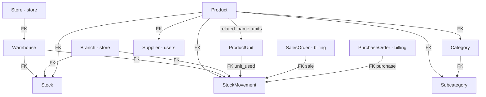

# Stock Module - Django Application

## Descripción General

El módulo `core.stock` es el núcleo del inventario. Define el catálogo de productos y su organización en categorías, los depósitos físicos (`Warehouse`), el stock real por ubicación (`Stock`), y el registro de todos los movimientos de inventario (`StockMovement`). El stock **nunca se modifica directamente desde su propia API**: toda modificación ocurre a través de billing (compras y ventas) o mediante transferencias internas creadas desde `StockMovementViewSet`. Todos sus endpoints son accesibles para cualquier usuario autenticado que no sea `client` (`IsNotClientPermission`).

---

## Modelos

### `Category`

Categoría de producto.

| Campo | Tipo | Notas |
|-------|------|-------|
| `name` | `CharField` (unique) | |
| `description` | `TextField` (nullable) | |
| `created_at`, `updated_at` | auto | |

### `Subcategory`

Subcategoría, siempre hija de una `Category`.

| Campo | Tipo | Notas |
|-------|------|-------|
| `category` | FK → `Category` (CASCADE) | |
| `name` | `CharField` | Único dentro de la categoría (no hay constraint, convención) |
| `description` | `TextField` (nullable) | |

### `Product`

El catálogo central de productos.

| Campo | Tipo | Notas |
|-------|------|-------|
| `sku` | `CharField` (unique) | Identificador del producto |
| `description` | `TextField` | Nombre/descripción del producto |
| `price` | `DecimalField` | Precio de venta |
| `cost_price` | `DecimalField` | Precio de costo (para valor de inventario) |
| `safety_stock` | `DecimalField(15,4)` | Nivel mínimo de stock; `0` = sin alerta |
| `unit_type` | choices | `count`, `weight`, `volume` |
| `base_unit_name` | choices | `unit`, `kg`, `g`, `l`, `ml` |
| `category` | FK → `Category` (SET_NULL) | |
| `subcategory` | FK → `Subcategory` (SET_NULL) | |
| `supplier` | FK → `Supplier` (SET_NULL) | |
| `image_1`, `image_2`, `image_3` | `ImageField` | Hasta 3 imágenes |
| `status` | choices | `active`, `discontinued` |

#### Sistema de unidades del producto

`unit_type` y `base_unit_name` definen cómo se mide el producto:

| `unit_type` | `base_unit_name` posibles | Ejemplo |
|-------------|--------------------------|---------|
| `count` | `unit` | Unidades, cajas |
| `weight` | `kg`, `g` | Kilos de harina |
| `volume` | `l`, `ml` | Litros de aceite |

Las `ProductUnit` (ver abajo) permiten trabajar en unidades alternativas que se convierten a la unidad base con un factor de conversión.

#### Organización de imágenes

Las imágenes se almacenan en: `media/assets/{store_slug}/{sku}/image_1.ext`

El `store_slug` se resuelve en tiempo de guardado usando el primer `Store` activo. Si no hay store activo, usa `"default_store"`. El nombre del archivo siempre es `image_1`, `image_2` o `image_3` (con la extensión del archivo original).

#### Eliminación lógica

`DELETE /products/{id}/` **no elimina** el registro: cambia `status` a `'discontinued'`. El producto deja de aparecer como disponible pero mantiene su historial de órdenes. Para eliminación física existe `DELETE /products/{id}/permanent_delete/`.

#### Propiedad `images`

```python
@property
def images(self):
    return [url for url in [self.image_1.url, self.image_2.url, self.image_3.url] if url]
```

### `ProductUnit`

Unidades de medida alternativas para un producto. Permite vender/comprar en unidades que no son la unidad base.

| Campo | Tipo | Notas |
|-------|------|-------|
| `product` | FK → `Product` (CASCADE, related_name: `units`) | |
| `name` | `CharField` | Ej: `"Caja x12"`, `"Pallet x48"` |
| `conversion_factor` | `DecimalField(12,4)` | Multiplicador a unidad base |

**Ejemplo**: Si el producto es en `unit` y existe una `ProductUnit` llamada `"Caja x12"` con `conversion_factor=12`, al vender 3 cajas se mueven `3 * 12 = 36` unidades del stock.

```python
real_quantity = Decimal(str(quantity)) * conversion_factor
```

Esta conversión se aplica en todos los movimientos de stock generados por billing.

### `Warehouse`

Depósito físico de mercadería. Siempre pertenece a una `Store`.

| Campo | Tipo | Notas |
|-------|------|-------|
| `store` | FK → `Store` (CASCADE, related_name: `warehouses`) | |
| `name` | `CharField` (unique) | |
| `country`, `state`, `city`, `address` | `CharField` | Datos de ubicación |

Solo `superadmin` puede crear depósitos (la creación asigna automáticamente el primer Store disponible).

No se puede eliminar un depósito que tenga stock asociado.

### `Stock`

Registro de inventario físico: cuánto hay de cada producto en cada ubicación.

| Campo | Tipo | Notas |
|-------|------|-------|
| `product` | FK → `Product` (CASCADE, related_name: `stocks`) | |
| `warehouse` | FK → `Warehouse` (SET_NULL, nullable) | XOR con branch |
| `branch` | FK → `Branch` (SET_NULL, nullable) | XOR con warehouse |
| `quantity` | `DecimalField(15,4)` | Siempre en unidad base del producto |

#### Constraints de unicidad

```python
UniqueConstraint(fields=['product', 'warehouse'], condition=Q(warehouse__isnull=False))
UniqueConstraint(fields=['product', 'branch'], condition=Q(branch__isnull=False))
```

Hay exactamente un registro `Stock` por (producto, ubicación). Una ubicación es o un `Warehouse` o una `Branch`, nunca ambos.

#### Stock inicial al crear un producto

Al crear un producto (vía API o importación), se crea automáticamente un registro `Stock` con `quantity=0` y sin ubicación (`warehouse=None, branch=None`). Este registro "sin ubicación" es un placeholder que se limpia cuando billing asigna la primera ubicación real.

#### Stock es read-only en la API

`StockViewSet` es un `ReadOnlyModelViewSet`. No existe endpoint `POST`, `PUT`, `PATCH` ni `DELETE` para Stock. **Las únicas formas de modificar el stock son**:

1. **Billing**: confirmar una orden de compra (suma) o completar una venta (resta).
2. **Transferencia interna**: `POST /api/stock/stock-movements/` desde `StockMovementViewSet`.
3. **Ajuste por importación Excel**: `POST /api/stock/stock/import_data/`.

### `StockMovement`

Registro de cada movimiento de inventario. Es el ledger del sistema de stock.

| Campo | Tipo | Notas |
|-------|------|-------|
| `product` | FK → `Product` (CASCADE) | |
| `warehouse` | FK → `Warehouse` (CASCADE, nullable) | Ubicación involucrada |
| `branch` | FK → `Branch` (CASCADE, nullable) | Ubicación involucrada |
| `movement_type` | choices | `IN`, `OUT`, `ADJ` |
| `from_location` | choices | `PUR`, `SAL`, `WHA`, `BRA`, `MOV` |
| `to_location` | choices | `PUR`, `SAL`, `WHA`, `BRA`, `MOV` |
| `status` | choices | `PEN`, `TRAN`, `REC`, `CAN` |
| `quantity` | `DecimalField(15,4)` | Siempre en unidad base |
| `unit_used` | FK → `ProductUnit` (SET_NULL, nullable) | Unidad con la que se registró |
| `conversion_factor_at_moment` | `DecimalField(10,4)` | Factor en el momento del movimiento |
| `sale` | FK → `SalesOrder` (SET_NULL, related_name: `stock_movements`) | |
| `purchase` | FK → `PurchaseOrder` (SET_NULL, related_name: `stock_movements`) | |
| `date` | `DateTimeField` (auto) | |
| `note` | `TextField` | Metadatos serializados en transferencias internas |
| `comments` | `JSONField` | Historial de cambios de estado |

#### Tabla de códigos

**`movement_type`**: `IN` = ingreso, `OUT` = egreso, `ADJ` = ajuste manual.

**`from_location` / `to_location`**: `PUR` = compra, `SAL` = venta, `WHA` = depósito, `BRA` = sucursal, `MOV` = movimiento interno.

**`status`**: `PEN` = pendiente, `TRAN` = en tránsito (reservado), `REC` = recibido/confirmado, `CAN` = cancelado.

#### Patrones de movimiento por origen

| Origen | `movement_type` | `from_location` | `to_location` | Estado inicial |
|--------|-----------------|-----------------|---------------|---------------|
| Venta pendiente | `OUT` | `BRA`/`WHA` | `SAL` | `TRAN` |
| Venta completada | (actualización a `REC`) | | | `REC` |
| Compra pendiente | `IN` | `PUR` | `WHA`/`BRA` | `TRAN` |
| Compra completada | (actualización a `REC`) | | | `REC` |
| Transferencia interna | `OUT` | `WHA`/`BRA` | `WHA`/`BRA` | `TRAN` |
| Ajuste Excel | `IN`/`OUT` | — | — | `REC` |

#### Método `add_comment`

```python
movement.add_comment(comment, status_before=None, user=None)
# Agrega un entry al JSONField comments y guarda el modelo.
```

Estructura del entry:
```json
{
    "date": "2026-05-21T10:30:00+00:00",
    "comment": "Descripción del cambio",
    "status_before": "TRAN",
    "status_after": "REC",
    "user": "Ana García",
    "user_id": 5
}
```

---

## ViewSets y Endpoints

**Base URL**: `/api/` (registrado en el router de stock)

| ViewSet | Prefijo | Permisos |
|---------|---------|----------|
| `ProductViewSet` | `products/` | `IsNotClientPermission` |
| `CategoryViewSet` | `categories/` | `IsNotClientPermission` |
| `SubcategoryViewSet` | `subcategories/` | `IsNotClientPermission` |
| `WarehouseViewSet` | `warehouses/` | `IsNotClientPermission` |
| `ProductUnitViewSet` | `productunits/` | `IsNotClientPermission` |
| `StockViewSet` | `stock/` | `IsNotClientPermission` |
| `StockMovementViewSet` | `stock-movements/` | `IsNotClientPermission` |

---

## ProductViewSet — Detalle de Endpoints

### CRUD estándar

```http
GET    /api/products/          # Listar (paginado, 5/página)
POST   /api/products/          # Crear
GET    /api/products/{id}/     # Detalle
PUT    /api/products/{id}/     # Actualizar completo
PATCH  /api/products/{id}/     # Actualización parcial
DELETE /api/products/{id}/     # Soft delete (status='discontinued')
```

**Filtros de listado**:

| Param | Descripción |
|-------|-------------|
| `search` | SKU, descripción o nombre de categoría |
| `category` | ID de categoría |
| `status` | `active` / `discontinued` |
| `supplier` | ID de proveedor |
| `all` | Si está presente, desactiva la paginación y devuelve todos |

### Actions personalizadas

```http
DELETE /api/products/{id}/permanent_delete/   # Eliminación física permanente
POST   /api/products/{id}/reactivate/         # Reactivar producto discontinuado
POST   /api/products/{id}/upload_image/       # Subir imagen (multipart)
DELETE /api/products/{id}/delete_image/       # Eliminar imagen(es)
GET    /api/products/export_template/         # Descargar plantilla Excel
GET    /api/products/export/                  # Exportar todos a CSV
POST   /api/products/import_data/             # Importar desde Excel
```

#### `upload_image`

Body: `multipart/form-data` con `image` (archivo) y `slot` (`image_1`, `image_2`, `image_3`).

- Valida: máximo 5MB, formatos JPEG/PNG/GIF/WebP.
- Si ya existe una imagen en ese slot, **elimina el archivo físico** antes de guardar el nuevo.
- Responde con la URL de la imagen subida y el estado de los 3 slots.

#### `delete_image`

Query param `slot`: `image_1`, `image_2`, `image_3` o `all`. Sin `slot`, elimina todas.

Elimina el archivo físico del disco y limpia el campo en la base de datos.

---

## StockViewSet — Detalle de Endpoints

`ReadOnlyModelViewSet`: solo `GET`.

```http
GET /api/stock/                # Listar (paginado, 5/página)
GET /api/stock/{id}/           # Detalle
GET /api/stock/low_stock_alert/ # Productos bajo safety_stock
GET /api/stock/export_template/ # Plantilla Excel para ajuste de stock
GET /api/stock/export/          # Exportar todo a CSV
POST /api/stock/import_data/    # Ajuste masivo de stock desde Excel
```

**Filtros de listado**:

| Param | Descripción |
|-------|-------------|
| `product` | ID de producto |
| `warehouse` | ID de depósito |
| `branch` | ID de sucursal |
| `low_stock` | `true` → solo registros con `quantity <= safety_stock` |
| `search` | Descripción o SKU del producto |

### Ajuste de stock por Excel (`import_data`)

1. Descargar plantilla con `export_template` (incluye stock actual y columna vacía "Nueva Cantidad").
2. Completar la columna "Nueva Cantidad" para los registros a ajustar.
3. Subir con `POST /api/stock/stock/import_data/`.

El proceso:
- Solo procesa filas donde "Nueva Cantidad" difiera de la actual (tolerancia `0.0001`).
- Para cada fila: crea un `StockMovement` tipo `ADJ` (`IN` si sube, `OUT` si baja) con status `REC`.
- Actualiza `Stock.quantity` directamente.
- Todo en `transaction.atomic()` con `bulk_create` y `bulk_update`.

---

## StockMovementViewSet — Detalle de Endpoints

```http
GET    /api/stock-movements/              # Listar (paginado, 5/página)
POST   /api/stock-movements/              # Crear transferencia interna
GET    /api/stock-movements/{id}/         # Detalle
PATCH  /api/stock-movements/{id}/         # Actualizar estado (solo internos)
GET    /api/stock-movements/by_product/   # Por producto (?product_id=N)
GET    /api/stock-movements/by_location/  # Por ubicación (?warehouse_id=N o ?branch_id=N)
GET    /api/stock-movements/recent/       # Más recientes (?limit=50)
GET    /api/stock-movements/pending/      # En PEN o TRAN
```

`DELETE` y `PUT` están deshabilitados (`http_method_names` excluye `delete` y `put`).

**Filtros de listado**:

| Param | Valores válidos |
|-------|----------------|
| `product` | ID |
| `warehouse` | ID |
| `branch` | ID |
| `movement_type` | `IN`, `OUT` |
| `status` | `PEN`, `TRAN`, `REC`, `CAN` |
| `from_location` | `PUR`, `SAL`, `WHA`, `BRA`, `MOV` |
| `to_location` | `PUR`, `SAL`, `WHA`, `BRA`, `MOV` |
| `sale` | ID de SalesOrder |
| `purchase` | ID de PurchaseOrder |
| `date_from` / `date_to` | `YYYY-MM-DD` |

### Crear transferencia interna (`POST`)

Mueve stock de una ubicación a otra dentro del sistema. **Las cantidades se actualizan inmediatamente**, y el movimiento queda en estado `TRAN`.

**Body requerido**:
```json
{
    "product": 5,
    "fromLocationType": "BRA",
    "fromLocation": 2,
    "toLocationType": "WHA",
    "toLocation": 1,
    "quantity": 50,
    "note": "Reposición desde sucursal al depósito central"
}
```

- `fromLocationType` / `toLocationType`: `"WHA"` (depósito) o `"BRA"` (sucursal).
- Valida que haya stock suficiente en el origen.
- Valida que origen y destino sean diferentes.
- La metadata de ubicaciones se serializa como JSON en el campo `note` del movimiento: `{"from_type": "BRA", "from_id": 2, "to_type": "WHA", "to_id": 1}`. Si el usuario agrega una nota propia, se concatena: `"{metadata}||nota del usuario"`.

### Actualizar estado (`PATCH`) — solo movimientos internos

Solo funciona en movimientos **sin** `sale` ni `purchase` asociado. Solo acepta el campo `status`.

**Transición a `CAN` (cancelación)**:
- Lee la metadata de `note` para identificar las ubicaciones.
- Revierte el stock: devuelve al origen, quita del destino.
- Si el stock en destino quedaría negativo, lo fija en `0`.
- Si el movimiento no tiene metadata (creado antes de esta versión), rechaza la cancelación.

**`REC` y `CAN` son terminales**: no se puede modificar el estado de un movimiento ya recibido o cancelado.

---

## Sistema de Importación/Exportación Excel

Todos los ViewSets principales (`ProductViewSet`, `WarehouseViewSet`, `ProductUnitViewSet`, `StockViewSet`) implementan el mismo patrón de tres acciones:

| Action | Método | Descripción |
|--------|--------|-------------|
| `export_template` | `GET` | Descarga `.xlsx` con encabezados, fila de ejemplo y hojas de catálogos de referencia |
| `export` | `GET` | Descarga CSV con todos los registros actuales (`utf-8-sig`, separador `;`, decimal `,`) |
| `import_data` | `POST` (multipart) | Sube un `.xlsx` y hace upsert (crea o actualiza según clave natural) |

### Patrón de importación optimizado

Para importaciones masivas, el código usa una estrategia de **4 queries fijas** independientemente del tamaño del archivo:

```python
# 1. Precargar todos los registros existentes en diccionarios indexados por clave natural
existing_products_map = {p.sku: p for p in Product.objects.all()}
categories_map = {c.id: c for c in Category.objects.all()}
# ...

# 2. Procesar todas las filas en memoria (0 queries adicionales)
for index, row in df.iterrows():
    existing = existing_map.get(natural_key)
    if existing:
        products_to_update.append(existing)
    else:
        products_to_create.append(Product(**data))

# 3. Bulk create + bulk update (2 queries)
with transaction.atomic():
    Product.objects.bulk_create(products_to_create)
    Product.objects.bulk_update(products_to_update, fields)
```

**Respuesta con errores parciales**: si algunas filas fallan y otras tienen éxito, retorna `HTTP 207 Multi-Status` con el campo `errors` listando los problemas por número de fila. Las filas válidas se procesan igual.

#### Claves naturales por entidad

| Entidad | Clave de upsert |
|---------|----------------|
| `Product` | `sku` |
| `Warehouse` | `(name, store_id)` |
| `ProductUnit` | `(product.sku, name)` |
| `Stock` (ajuste) | `stock_id` (ID directo) |

---

## Serializers

### `ProductSerializer`

- `to_representation` construye URLs absolutas de imágenes usando `request.build_absolute_uri()`.
- Incluye campos de display: `base_unit_name_display`, `unit_type_display` (usando `.get_FOO_display()`).
- `safety_stock` se normaliza con `.normalize()` para eliminar ceros trailing (ej: `10.0000` → `10`).
- Valida imágenes: máximo 5MB, formatos JPEG/PNG/GIF/WebP.

### `ProductUnitSerializer`

- `conversion_factor` normalizado con `.normalize()`.
- `to_representation` expande `product` como objeto `{id, description, sku}`.

### `WarehouseSerializer`

- `to_representation` expande `store` como objeto `{id, name}`.

### `StockSerializer`

Serializer de **solo lectura** con múltiples campos calculados:

| Campo | Descripción |
|-------|-------------|
| `product_detail` | Objeto con sku, descripción, safety_stock, unidad, status, proveedor |
| `warehouse_detail` / `branch_detail` | Datos de la ubicación |
| `location_name` | Nombre de la ubicación (warehouse o branch) |
| `is_low_stock` | `True` si `quantity < product.safety_stock` |
| `purchase_order_pending` | Cantidad en POs aprobadas pendientes de recepción en esa ubicación |
| `sale_order_pending` | Cantidad en SOs pendientes/processing no entregadas desde esa ubicación |

> **Nota**: `purchase_order_pending` usa `status='approved'` que no existe como valor en el modelo (`PurchaseOrder.STATUS_CHOICES` tiene `draft`, `pending`, `completed`, `cancelled`). Este campo puede no retornar datos correctos hasta que se alinee el filtro con los estados reales.

`quantity` se normaliza con `.normalize()`.

### `StockMovementSerializer`

Serializer de solo lectura. Enriquece todos los campos FK con sus objetos completos: `product_detail`, `warehouse_detail`, `branch_detail`, `unit_detail`, `sale_detail` (`"V-0042"`), `purchase_detail` (`"OC-0017"`). Incluye versiones display de todos los campos choices.

---

## Relaciones entre Modelos



---

## Estructura de Archivos

```
core/stock/
├── models.py       # Category, Subcategory, Product, ProductUnit, Warehouse, Stock, StockMovement
├── serializers.py  # 7 serializers, todos con to_representation personalizados
├── views.py        # 7 ViewSets con actions de Excel y transferencias internas
├── urls.py         # Router con los 7 ViewSets registrados
├── admin.py
├── apps.py
└── migrations/
```

---

## Casos de Uso Típicos

### 1. Crear un producto con unidades alternativas

```http
POST /api/products/
{
    "sku": "HARINA-1KG",
    "description": "Harina 000 x 1kg",
    "price": 850,
    "cost_price": 600,
    "unit_type": "weight",
    "base_unit_name": "kg",
    "safety_stock": 50,
    "category": 3
}
# → Se crea automáticamente Stock con quantity=0 sin ubicación

POST /api/productunits/
{ "product": 42, "name": "Bolsa x25kg", "conversion_factor": 25 }
# → Ahora se puede vender en "bolsas" y el sistema convierte a kg
```

### 2. Consultar stock por ubicación

```http
GET /api/stock/?branch=2&search=harina
GET /api/stock/?low_stock=true
GET /api/stock/low_stock_alert/
```

### 3. Consultar movimientos de una orden de venta

```http
GET /api/stock-movements/?sale=88
GET /api/stock-movements/?status=TRAN&branch=2
```

### 4. Transferencia interna de stock entre ubicaciones

```http
POST /api/stock-movements/
{
    "product": 42,
    "fromLocationType": "WHA",
    "fromLocation": 1,
    "toLocationType": "BRA",
    "toLocation": 3,
    "quantity": 100,
    "note": "Reposición para sucursal Rosario"
}
# → Stock se mueve inmediatamente, movimiento queda en TRAN

# Si necesitamos revertir:
PATCH /api/stock-movements/205/
{ "status": "CAN" }
# → Stock se revierte, movimiento queda en CAN
```

### 5. Importar catálogo masivo de productos

```http
# Paso 1: Descargar plantilla con catálogos de referencia
GET /api/products/export_template/
# → productos_plantilla.xlsx con hojas: Productos, Categorías, Subcategorías, Proveedores, Instrucciones

# Paso 2: Completar y subir
POST /api/products/import_data/
Content-Type: multipart/form-data
file: productos_completos.xlsx
# → { "created": 45, "updated": 12, "errors": [...] }
```

### 6. Subir imagen de producto

```http
POST /api/products/42/upload_image/
Content-Type: multipart/form-data
slot: image_2
image: <archivo>
# → Imagen guardada en media/assets/{store-slug}/HARINA-1KG/image_2.jpg
```

---

## Consideraciones de Diseño

### Stock como entidad derivada

`Stock.quantity` es el resultado acumulado de todos los `StockMovement` con status `REC`. En teoría podría recalcularse en cualquier momento sumando los movimientos históricos. En la práctica, se mantiene actualizado incrementalmente (con `F()` expressions) por billing y por el ViewSet de transferencias internas. Si hay inconsistencias, la importación Excel es el mecanismo de corrección manual.

### Movimientos internos: stock inmediato, estado diferido

Cuando se crea una transferencia interna, el stock **se mueve de inmediato** en la base de datos, pero el movimiento queda en estado `TRAN`. Esto es una simplificación deliberada: en transferencias entre ubicaciones de la misma organización no hay un proceso de confirmación de recepción. El estado `TRAN` es informativo; el stock ya cambió.

### Metadata en `note` para reversión

El campo `note` de los movimientos internos contiene un JSON embebido con las ubicaciones de origen y destino. Esto permite que `PATCH` a `CAN` revierta correctamente el stock sin necesidad de una tabla adicional. El formato `"metadata||nota_usuario"` separa el JSON técnico del texto libre del usuario.

### Permisos: `IsNotClientPermission`

Todo el módulo de stock es inaccesible para usuarios con rol `client`. Los clientes del ecommerce solo acceden al catálogo a través de los endpoints públicos del módulo `ecommerce`, que tienen su propia serialización de productos con lógica de stock simplificada.

---

*Este documento sirve como referencia completa para desarrolladores y agentes de IA que trabajen con el módulo de stock.*
