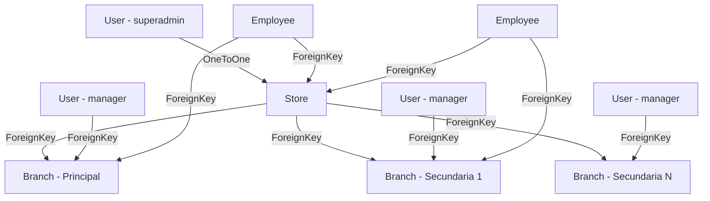

# Stores Module - Django Application

## 📋 Descripción General

El módulo `core.store` es una aplicación Django que maneja la gestión de tiendas y sucursales en un sistema multi-tenant. Proporciona funcionalidades completas para crear, administrar y sincronizar tiendas con sus sucursales, incluyendo un sistema de roles y permisos granulares, sincronización automática de datos entre tienda principal y sucursales, y gestión de propietarios y managers.

## 🏗️ Arquitectura del Módulo

### Modelos Principales

#### 1. **Store (Tienda)**
- **Propósito**: Modelo principal que representa una tienda en el sistema
- **Características**: 
  - Identificación única con slug automático
  - Sistema de activación/desactivación
  - Modo de solo lectura
  - Gestión de propietario (OneToOne con User)
  - Upload de logo con organización por carpetas
- **Campos principales**:
  - `name`: Nombre único de la tienda
  - `slug`: Identificador URL-friendly generado automáticamente
  - `is_active`: Estado de activación de la tienda
  - `view_only`: Modo de solo visualización
  - `owner`: Usuario propietario (OneToOne)
  - `logo`: Imagen de la tienda
  - Datos de ubicación: `country`, `state`, `postal_code`, `city`, `address`, `phone`

#### 2. **Branch (Sucursal)**
- **Propósito**: Representa las sucursales de una tienda
- **Relaciones**: FK a Store y User (manager)
- **Características**:
  - Cada tienda tiene una sucursal principal automática
  - Sincronización bidireccional con la tienda principal
  - Gestión de managers por sucursal
  - Datos de ubicación independientes

### Sistema de Upload de Archivos

```python
def _upload_to(instance, filename, folder):
    store_name = slugify(instance.store.name) if instance.store and instance.store.name else "default"
    return f'storelogos/{store_name}/{filename}'
```

Los logos se organizan automáticamente en carpetas por tienda: `storelogos/nombre-tienda/logo.jpg`

## 🔐 Sistema de Permisos y Roles

### Jerarquía de Acceso para Stores

```
superadmin (Acceso global)
├── store_admin/owner (Gestión completa de su tienda)
│   └── manager (Gestión de su sucursal)
│       └── employee (Sin acceso directo a stores)
```

### Reglas de Permisos Implementadas

#### StoreViewSet
- **Crear tienda**: Solo `superadmin`
- **Actualizar tienda**: `owner`, `manager` o `superadmin`
- **Eliminar tienda**: `owner` o `superadmin`
- **Activar/Desactivar**: `owner` o `admin`

#### BranchViewSet
- **Crear sucursal**: Solo `superadmin`
- **Actualizar sucursal**: `owner de la tienda`, `manager` o `superadmin`
- **Eliminar sucursal**: `owner de la tienda` o `superadmin`
- **Restricción especial**: No se puede eliminar la sucursal principal

## 🎯 ViewSets y Endpoints

### StoreViewSet
**Base URL**: `/api/store/stores/`

#### Endpoints Estándar
```http
GET    /api/stores/          # Listar todas las tiendas
POST   /api/stores/          # Crear nueva tienda
GET    /api/stores/{id}/     # Detalle de tienda
PUT    /api/stores/{id}/     # Actualizar tienda completa
PATCH  /api/stores/{id}/     # Actualización parcial
DELETE /api/stores/{id}/     # Eliminar tienda
```

#### Endpoints Personalizados
```http
PATCH  /api/stores/{id}/activate/    # Activar tienda
PATCH  /api/stores/{id}/deactivate/  # Desactivar tienda
GET    /api/stores/{id}/branches/    # Sucursales de la tienda
```

### BranchViewSet
**Base URL**: `/api/store/branches/`

#### Endpoints Estándar
```http
GET    /api/branches/          # Listar todas las sucursales
POST   /api/branches/          # Crear nueva sucursal
GET    /api/branches/{id}/     # Detalle de sucursal
PUT    /api/branches/{id}/     # Actualizar sucursal
PATCH  /api/branches/{id}/     # Actualización parcial
DELETE /api/branches/{id}/     # Eliminar sucursal
```

## 📊 Serializers

### Serializers Principales

#### 1. **StoreSerializer**
- **Propósito**: Serializer completo para operaciones CRUD de tiendas
- **Características**:
  - Incluye sucursales anidadas (read-only)
  - Información del propietario
  - Sincronización automática con sucursal principal

#### 2. **StoreCreateSerializer**
- **Propósito**: Serializer simplificado para creación de tiendas
- **Funcionalidades**:
  - Asignación automática del owner (usuario actual)
  - Creación automática de sucursal principal
  - Estado inicial: `is_active = False`

#### 3. **StoreActivationSerializer**
- **Propósito**: Manejo específico de activación/desactivación
- **Campos**: `is_active`, `view_only`

#### 4. **BranchSerializer**
- **Propósito**: Gestión completa de sucursales
- **Características**:
  - Validación de managers
  - Sincronización bidireccional con Store
  - Gestión automática de Employee assignments

### Validaciones Implementadas

#### Store Validations
```python
def validate_owner(self, value):
    if value.role not in ['superadmin']:
        raise serializers.ValidationError("El propietario debe ser superadmin.")
    return value
```

#### Branch Validations
```python
def validate_manager(self, value):
    if value.role not in ['manager', 'superadmin']:
        raise serializers.ValidationError(
            "El gerente de la sucursal debe tener el rol de manager o superadmin."
        )
    return value
```

## 🔄 Sistema de Sincronización

### Sincronización Store ↔ Branch Principal

El sistema mantiene sincronizados automáticamente los datos de ubicación entre la tienda y su sucursal principal:

#### Campos Sincronizados
- `country`
- `state` 
- `postal_code`
- `city`
- `address`

#### Flujo de Sincronización

1. **Store → Branch**: Cuando se actualiza la tienda, los cambios se propagan a la sucursal principal
2. **Branch → Store**: Cuando se actualiza la sucursal principal, los cambios se propagan a la tienda

```python
# Ejemplo de sincronización en StoreSerializer.update()
sync_fields = ['country', 'state', 'postal_code', 'city', 'address']
fields_changed = []
for field in sync_fields:
    if field in validated_data and old_values[field] != getattr(updated_store, field):
        fields_changed.append(field)

if fields_changed:
    main_branch = Branch.objects.get(
        store=updated_store, 
        name__endswith="- Sucursal Principal"
    )
    # Actualizar campos en la sucursal principal
```

## 🤖 Automatizaciones

### 1. Creación Automática de Sucursal Principal

Cuando se crea una tienda, automáticamente se genera:

```python
main_branch = Branch.objects.create(
    store=store,
    manager=store.owner,
    name=f"{store.name} - Sucursal Principal",
    country=store.country,
    state=store.state,
    postal_code=store.postal_code,
    city=store.city,
    address=store.address
)
```

### 2. Gestión Automática de Employee Assignments

El sistema actualiza automáticamente las asignaciones de empleados cuando:
- Se cambia el manager de una sucursal
- Se crea una nueva sucursal
- Se actualiza la estructura organizacional

```python
# Actualizar Employee model cuando cambia el manager
if old_manager != new_manager:
    from users.models import Employee
    
    # Limpiar asignación anterior
    if old_manager:
        old_manager_employee.branch = None
        
    # Asignar nueva sucursal
    if new_manager:
        new_manager_employee.branch = updated_branch
```

### 3. Generación Automática de Slugs

```python
def save(self, *args, **kwargs):
    if not self.slug:
        self.slug = slugify(self.name)
    super().save(*args, **kwargs)
```

## 🛡️ Validaciones y Restricciones

### Restricciones de Eliminación

1. **Sucursal Principal**: No se puede eliminar la sucursal principal
```python
if instance.name.endswith("- Sucursal Principal"):
    return Response(
        {"error": "No puedes eliminar la sucursal principal"}, 
        status=status.HTTP_400_BAD_REQUEST
    )
```

2. **Permisos por Rol**: Validación estricta de permisos según el rol del usuario

### Validaciones de Integridad

- **Manager válido**: Solo usuarios con rol `manager` o `superadmin` pueden ser managers de sucursal
- **Owner de Store**: Solo `superadmin` puede ser owner de una store
- **Coherencia de datos**: Sincronización automática mantiene consistencia

## 🗄️ Estructura de Archivos

```
core/store/
├── models.py              # Store y Branch models
├── serializer.py          # Serializers para API
├── views.py              # ViewSets con lógica de negocio
├── urls.py               # Configuración de rutas
├── admin.py              # Configuración del admin
├── apps.py               # Configuración de la app
└── migrations/           # Migraciones de base de datos
```

## 🔄 Relaciones entre Modelos



## 🚀 Funcionalidades Destacadas

### 1. **Multi-tenancy Ready**
- Soporte completo para múltiples tiendas
- Aislamiento de datos por tenant
- Sincronización automática entre entidades

### 2. **Gestión Jerárquica**
- Estructura Store → Branch → Employees
- Permisos granulares por nivel
- Asignaciones automáticas de roles

### 3. **Sincronización Inteligente**
- Bidireccional entre Store y Branch principal
- Detección automática de cambios
- Actualización solo de campos modificados

### 4. **API REST Completa**
- Endpoints RESTful estándar
- Acciones personalizadas (activate/deactivate)
- Filtros y relaciones anidadas

### 5. **Upload Organizado de Archivos**
- Estructura de carpetas por tienda
- Nombres de archivo seguros (slugify)
- Gestión automática de paths

## 📝 Configuración Requerida

### Settings de Django
```python
# En settings.py
MEDIA_URL = '/media/'
MEDIA_ROOT = os.path.join(BASE_DIR, 'media')

# Para upload de archivos
FILE_UPLOAD_MAX_MEMORY_SIZE = 10 * 1024 * 1024  # 10MB
```

### URLs del Proyecto
```python
# En urls.py principal
urlpatterns = [
    path('api/store/', include('core.store.urls')),
    # ...
]

# Para servir archivos en desarrollo
if settings.DEBUG:
    urlpatterns += static(settings.MEDIA_URL, document_root=settings.MEDIA_ROOT)
```

## 🧪 Casos de Uso Comunes

### 1. Creación de Nueva Tienda
```python
# POST /api/store/stores/
{
    "name": "Mi Tienda",
    "country": "Argentina",
    "state": "Buenos Aires",
    "city": "CABA",
    "address": "Av. Corrientes 1234",
    "phone": "+54 11 1234-5678"
}

# Resultado automático:
# - Store creada con owner = usuario actual
# - Sucursal principal creada automáticamente
# - Employee assignment actualizado
```

### 2. Activación de Tienda
```python
# PATCH /api/store/stores/{id}/activate/
# Solo owner o admin pueden activar
```

### 3. Gestión de Sucursales
```python
# GET /api/store/stores/{id}/branches/
# Obtiene todas las sucursales de una tienda

# POST /api/store/branches/
{
    "store": 1,
    "manager": 2,
    "name": "Sucursal Norte",
    "country": "Argentina",
    "state": "Buenos Aires",
    "city": "San Isidro",
    "address": "Av. Libertador 5678"
}
```

## 🔧 Comandos y Utilidades

### Integración con setup_company.py
El módulo se integra con el comando de configuración de empresas del módulo users:

```python
# En users/management/commands/setup_company.py
# Se crea automáticamente una Store para cada tenant
# Se configura la estructura básica Store → Branch → Employee
```

## 📊 Métricas y Monitoreo

### Campos de Auditoría
Todos los modelos incluyen:
- `created_at`: Timestamp de creación
- `updated_at`: Timestamp de última actualización

### Estados de Store
- `is_active`: Tienda activa/inactiva
- `view_only`: Modo de solo lectura

## 🎯 Próximas Mejoras Sugeridas

1. **Dashboard de Analytics**
   - Métricas por tienda
   - Comparativas entre sucursales
   - Reportes de actividad

2. **Sistema de Notificaciones**
   - Alertas de cambios importantes
   - Notificaciones a managers
   - Logs de sincronización

3. **Backup y Versionado**
   - Historial de cambios en Store/Branch
   - Rollback de configuraciones
   - Auditoría detallada

4. **Geolocalización**
   - Integración con mapas
   - Cálculo de distancias
   - Zonificación automática

5. **Templates de Store**
   - Configuraciones predefinidas
   - Clonado de estructuras
   - Mejores prácticas automatizadas

## 📞 Integración con Otros Módulos

### Módulos Dependientes
- **users**: Relación directa con User (owner, manager)
- **users.Employee**: Asignaciones automáticas de sucursales
- **products**: Inventario por sucursal (futuro)
- **sales**: Ventas por tienda/sucursal (futuro)

### Módulos que lo Utilizan
- **CRM**: Segmentación por tienda
- **Inventory**: Stock por sucursal
- **Reports**: Reportes organizacionales
- **Billing**: Facturación por entidad

## 🔐 Consideraciones de Seguridad

1. **Validación de Permisos**: Estricta validación en cada operación
2. **Aislamiento de Datos**: Los usuarios solo ven sus tiendas/sucursales
3. **Auditoría**: Logs automáticos de cambios importantes
4. **Upload Seguro**: Validación de tipos de archivo para logos

## 📚 Ejemplos de Implementación

### Frontend Integration
```javascript
// Obtener tiendas del usuario
const stores = await api.get('/api/store/stores/');

// Activar/Desactivar tienda
await api.patch(`/api/store/stores/${storeId}/activate/`);

// Crear nueva sucursal
const newBranch = await api.post('/api/store/branches/', {
    store: storeId,
    manager: managerId,
    name: 'Nueva Sucursal',
    // ... datos de ubicación
});
```

### Backend Usage
```python
# En otras apps del proyecto
from core.store.models import Store, Branch

# Obtener sucursales de una tienda
branches = Branch.objects.filter(store=store)

# Verificar si es sucursal principal
is_main = branch.name.endswith("- Sucursal Principal")

# Sincronización manual (normalmente automática)
store.sync_with_main_branch()
```

---

*Este documento sirve como referencia completa para desarrolladores y agentes de IA que trabajen con el módulo de tiendas y sucursales.*