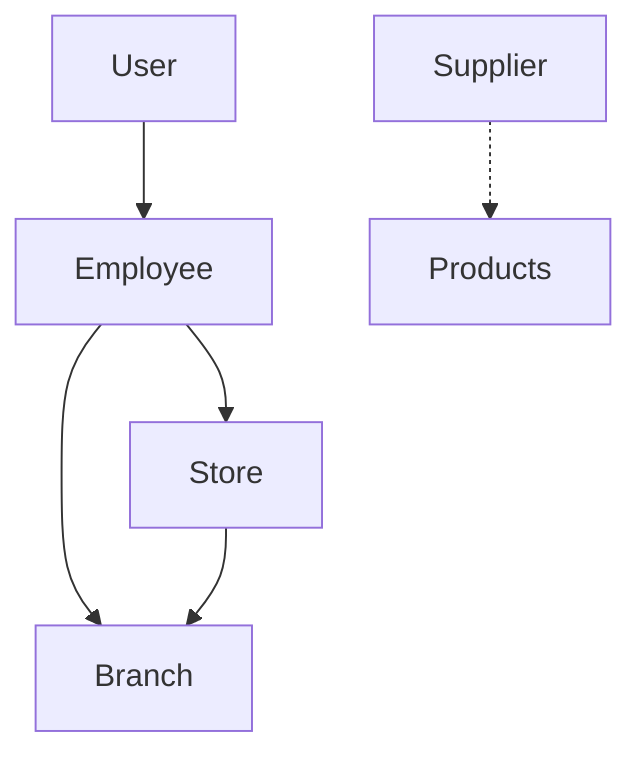

# Users Module - Django Application

## 📋 Descripción General

El módulo `users` es una aplicación Django completa que maneja la gestión de usuarios, empleados y proveedores en un sistema multi-tenant. Incluye autenticación con 2FA (Two-Factor Authentication), autorización basada en roles, y gestión completa de perfiles.

## 🏗️ Arquitectura del Módulo

### Modelos Principales

#### 1. **User (Usuario personalizado)**
- **Propósito**: Modelo de usuario principal que extiende AbstractBaseUser
- **Características**: 
  - Autenticación por email
  - Sistema de roles jerárquicos
  - Soporte para 2FA con TOTP
  - Gestión de primer login
- **Roles disponibles**:
  - `superadmin`: Administrador global del sistema
  - `manager`: Administrador de sucursal
  - `employee`: Empleado regular
  - `client`: Cliente del sistema

#### 2. **Employee (Empleado)**
- **Propósito**: Información extendida para usuarios empleados
- **Relaciones**: FK a User, Store y Branch
- **Datos**: Información personal, laboral y de ubicación

#### 3. **Supplier (Proveedor)**
- **Propósito**: Gestión de proveedores del sistema
- **Datos**: Información comercial y de contacto

## 🔐 Sistema de Autenticación

### Características de Seguridad

1. **Autenticación por Email**: No utiliza username, solo email
2. **Two-Factor Authentication (2FA)**:
   - Basado en TOTP (Time-based One-Time Password)
   - Generación automática de códigos QR
   - Obligatorio para primer login
3. **JWT Tokens**: Autenticación stateless con refresh tokens
4. **Gestión de Primer Login**: Fuerza configuración de 2FA en primer acceso

### Endpoints de Autenticación

```python
# URLs principales de autenticación
POST /api/users/auth/login/          # Inicio de sesión
POST /api/users/auth/verify-otp/     # Verificación OTP
POST /api/users/auth/enable-2fa/     # Activación 2FA
```

### Flujo de Autenticación

1. **Login inicial**: `POST /auth/login/`
   - Si 2FA no está habilitado: Retorna QR code para configurar
   - Si 2FA está habilitado: Solicita código OTP

2. **Verificación OTP**: `POST /auth/verify-otp/`
   - Valida código TOTP
   - Retorna access y refresh tokens

3. **Activación 2FA**: `POST /auth/enable-2fa/`
   - Confirma configuración inicial de 2FA
   - Marca first_login como False

## 🎯 ViewSets y Endpoints

### UserModelViewSet
- **Base URL**: `/api/users/users/`
- **Operaciones**: CRUD completo con permisos diferenciados
- **Endpoint especial**: `/api/users/users/me/` - Información del usuario actual

### EmployeeViewSet
- **Base URL**: `/api/users/employees/`
- **Permisos**: Basados en roles y jerarquía organizacional
- **Funcionalidades**:
  - Creación con datos de usuario anidados
  - Filtros por sucursal
  - Validaciones de permisos por rol

### SupplierViewSet
- **Base URL**: `/api/users/suppliers/`
- **Operaciones**: CRUD completo para proveedores
- **Búsqueda**: Endpoint de búsqueda personalizada

## 📊 Serializers

### Serializers Principales

1. **UserSerializer**: Gestión básica de usuarios
2. **EmployeeSerializer**: Vista completa de empleados con datos relacionados
3. **EmployeeCreateSerializer**: Creación de empleados con usuario anidado
4. **EmployeeUpdateSerializer**: Actualización con gestión de roles
5. **SupplierSerializer**: Gestión de proveedores
6. **UserWithEmployeeSerializer**: Usuario con información de empleado extendida

### Validaciones Implementadas

- **Email**: Formato y unicidad
- **DNI**: Longitud y formato argentino
- **Roles**: Validación de roles permitidos
- **CUIT**: Formato de CUIT argentino

## 🔧 Comandos de Gestión

### setup_company.py
Comando personalizado para configuración inicial de empresas en el sistema multi-tenant. 
Primero debemos verificar que en nuestra base de datos este creado el schema public, y corremos
```bash
python manage.py makemigrations main
python manage.py migrate_schemas --schema=public
```
Una vez creada nuestro schema public donde guardaremos el tenantcy, podremos correr el comando para setear un nuevo tenant (compañia) 

**Uso**:
```bash
python manage.py setup_company "Empresa Demo" empresa_demo empresa.localhost admin@empresa.com password123
```

**Funcionalidades**:
1. Creación de tenant (esquema de base de datos)
2. Configuración de dominio
3. Migraciones automáticas
4. Creación de superusuario
5. Configuración de tienda y sucursal principal

## 🔒 Sistema de Permisos

### Jerarquía de Roles

```
superadmin (Acceso global)
    ├── manager (Acceso a su sucursal)
    │   └── employee (Acceso limitado)
    └── client (Solo lectura de su perfil)
```

### Reglas de Acceso

- **Superadmin**: Acceso completo a todos los recursos
- **Manager**: 
  - Gestión de empleados de su sucursal
  - Visualización de datos de su sucursal
- **Employee**: 
  - Edición de su propio perfil
  - Visualización limitada
- **Client**: Solo su información personal

## 🗄️ Estructura de Archivos

```
users/
├── models.py              # Modelos User, Employee, Supplier
├── serializer.py          # Serializers para API
├── views.py              # ViewSets y vistas personalizadas
├── authentication.py     # Lógica de autenticación y 2FA
├── urls.py               # Configuración de rutas
├── admin.py              # Configuración del admin (básica)
├── management/
│   └── commands/
│       └── setup_company.py  # Comando de configuración
└── migrations/           # Migraciones de base de datos
```

## 🔄 Relaciones entre Modelos



## 🚀 Funcionalidades Destacadas

### 1. Multi-tenancy
- Soporte completo para múltiples empresas
- Aislamiento de datos por tenant
- Configuración automática con comando personalizado

### 2. Seguridad Avanzada
- 2FA obligatorio
- Gestión de tokens JWT
- Validaciones robustas

### 3. Flexibilidad de Roles
- Sistema jerárquico
- Permisos granulares
- Escalabilidad para nuevos roles

### 4. API REST Completa
- Endpoints RESTful
- Documentación automática
- Filtros y búsquedas

## 📝 Configuración Requerida

### Variables de Entorno
```env
# En settings.py o .env
AUTH_USER_MODEL = 'users.User'
```

### Dependencias
```python
# requirements.txt principales para este módulo
djangorestframework
djangorestframework-simplejwt
pyotp
qrcode
django-tenants  # Para multi-tenancy
```

## 🧪 Testing

El módulo incluye estructura para tests en `tests.py`, recomendado para:
- Tests de autenticación
- Validaciones de permisos
- Flujos de 2FA
- Operaciones CRUD

## 📚 Uso del Módulo

### Ejemplo de Integración
```python
# En otras apps del proyecto
from users.models import User, Employee, Supplier

# Obtener empleados de una sucursal
employees = Employee.objects.filter(branch_id=branch_id)

# Verificar permisos
if request.user.role == 'superadmin':
    # Acceso completo
    pass
```

## 🎯 Próximas Mejoras Sugeridas

1. **Logging avanzado** para auditoría de seguridad
2. **Cache** para consultas frecuentes de usuarios
3. **Notificaciones** por email para eventos importantes
4. **API de recuperación de contraseña**
5. **Gestión de sesiones** múltiples por usuario

## 📞 Integración con Otros Módulos

- **Store/Branch**: Relación directa con empleados
- **Products**: Relación con proveedores
- **Audit**: Logging de cambios en usuarios
- **CRM**: Gestión de clientes

---

*Este documento sirve como referencia completa para desarrolladores y agentes de IA que trabajen con el módulo de usuarios.*